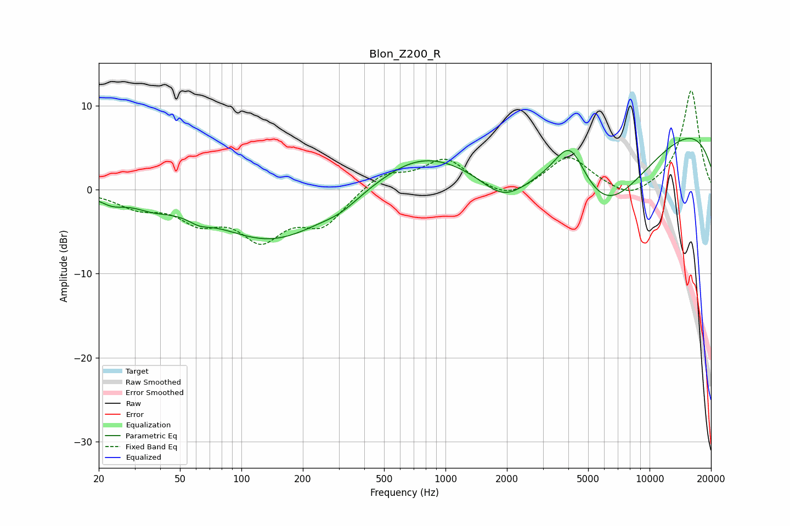

# Blon_Z200_R
See [usage instructions](https://github.com/jaakkopasanen/AutoEq#usage) for more options and info.

### Parametric EQs
Apply preamp of -6.2 dB when using parametric equalizer.

|   # | Type    |   Fc (Hz) |    Q |   Gain (dB) |
|-----|---------|-----------|------|-------------|
|   1 | Peaking |        23 | 2.32 |        -1   |
|   2 | Peaking |        37 | 1.47 |        -1.1 |
|   3 | Peaking |        62 | 2.61 |        -0.8 |
|   4 | Peaking |       141 | 0.51 |        -6   |
|   5 | Peaking |       306 | 1.62 |        -0.9 |
|   6 | Peaking |       740 | 0.64 |         3.8 |
|   7 | Peaking |      1928 | 1.18 |        -3.7 |
|   8 | Peaking |      4078 | 1.73 |         6.1 |
|   9 | Peaking |      5953 | 0.52 |       -12.4 |
|  10 | Peaking |      8836 | 0.18 |        10.5 |

### Fixed Band EQs
When using fixed band (also called graphic) equalizer, apply preamp of **-11.9 dB** (if available) and set gains manually with these parameters.

|   # | Type    |   Fc (Hz) |    Q |   Gain (dB) |
|-----|---------|-----------|------|-------------|
|   1 | Peaking |        31 | 1.41 |        -1.8 |
|   2 | Peaking |        62 | 1.41 |        -3.2 |
|   3 | Peaking |       125 | 1.41 |        -5.2 |
|   4 | Peaking |       250 | 1.41 |        -3.9 |
|   5 | Peaking |       500 | 1.41 |         2   |
|   6 | Peaking |      1000 | 1.41 |         3.6 |
|   7 | Peaking |      2000 | 1.41 |        -1.5 |
|   8 | Peaking |      4000 | 1.41 |         4   |
|   9 | Peaking |      8000 | 1.41 |        -1.4 |
|  10 | Peaking |     16000 | 1.41 |        11.9 |

### Graphs

