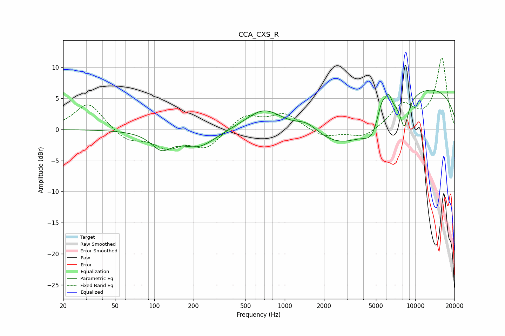

# CCA_CXS_R
See [usage instructions](https://github.com/jaakkopasanen/AutoEq#usage) for more options and info.

### Parametric EQs
Apply preamp of -6.4 dB when using parametric equalizer.

|   # | Type    |   Fc (Hz) |    Q |   Gain (dB) |
|-----|---------|-----------|------|-------------|
|   1 | Peaking |       113 | 1.81 |        -2.7 |
|   2 | Peaking |       219 | 1.08 |        -2.7 |
|   3 | Peaking |       696 | 1.01 |         3.5 |
|   4 | Peaking |      1480 | 1.65 |         1.7 |
|   5 | Peaking |      2965 | 0.57 |        -6.2 |
|   6 | Peaking |      4733 | 2.06 |        -3.4 |
|   7 | Peaking |      5534 | 3.54 |         3.5 |
|   8 | Peaking |      6268 | 5.92 |         2   |
|   9 | Peaking |      8257 | 4.02 |        -4.8 |
|  10 | Peaking |     10000 | 0.21 |         7.2 |

### Fixed Band EQs
When using fixed band (also called graphic) equalizer, apply preamp of **-11.6 dB** (if available) and set gains manually with these parameters.

|   # | Type    |   Fc (Hz) |    Q |   Gain (dB) |
|-----|---------|-----------|------|-------------|
|   1 | Peaking |        31 | 1.41 |         4.4 |
|   2 | Peaking |        62 | 1.41 |        -1.9 |
|   3 | Peaking |       125 | 1.41 |        -2.6 |
|   4 | Peaking |       250 | 1.41 |        -2.9 |
|   5 | Peaking |       500 | 1.41 |         2.4 |
|   6 | Peaking |      1000 | 1.41 |         2.5 |
|   7 | Peaking |      2000 | 1.41 |        -1.3 |
|   8 | Peaking |      4000 | 1.41 |        -1.5 |
|   9 | Peaking |      8000 | 1.41 |         3.8 |
|  10 | Peaking |     16000 | 1.41 |        11.4 |

### Graphs

