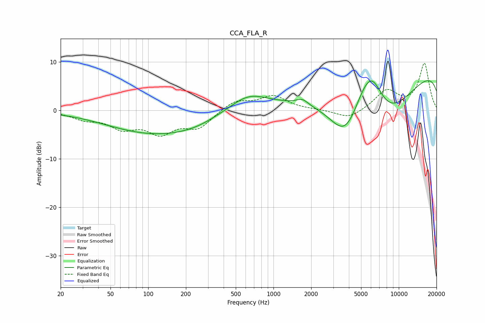

# CCA_FLA_R
See [usage instructions](https://github.com/jaakkopasanen/AutoEq#usage) for more options and info.

### Parametric EQs
Apply preamp of -6.3 dB when using parametric equalizer.

|   # | Type    |   Fc (Hz) |    Q |   Gain (dB) |
|-----|---------|-----------|------|-------------|
|   1 | Peaking |        82 | 0.56 |        -0.4 |
|   2 | Peaking |       162 | 0.28 |        -5   |
|   3 | Peaking |       344 | 1.2  |         0.5 |
|   4 | Peaking |       616 | 0.83 |         4.6 |
|   5 | Peaking |      1699 | 3.09 |         1.2 |
|   6 | Peaking |      3754 | 1.1  |        -8.2 |
|   7 | Peaking |      5177 | 1.49 |         3   |
|   8 | Peaking |      6108 | 1.36 |         8.6 |
|   9 | Peaking |      7701 | 0.43 |       -15.2 |
|  10 | Peaking |     10000 | 0.18 |        13.5 |

### Fixed Band EQs
When using fixed band (also called graphic) equalizer, apply preamp of **-9.8 dB** (if available) and set gains manually with these parameters.

|   # | Type    |   Fc (Hz) |    Q |   Gain (dB) |
|-----|---------|-----------|------|-------------|
|   1 | Peaking |        31 | 1.41 |        -1.5 |
|   2 | Peaking |        62 | 1.41 |        -3.2 |
|   3 | Peaking |       125 | 1.41 |        -4.2 |
|   4 | Peaking |       250 | 1.41 |        -3.4 |
|   5 | Peaking |       500 | 1.41 |         2.1 |
|   6 | Peaking |      1000 | 1.41 |         2.9 |
|   7 | Peaking |      2000 | 1.41 |         0.1 |
|   8 | Peaking |      4000 | 1.41 |        -1.9 |
|   9 | Peaking |      8000 | 1.41 |         4   |
|  10 | Peaking |     16000 | 1.41 |         9.6 |

### Graphs

