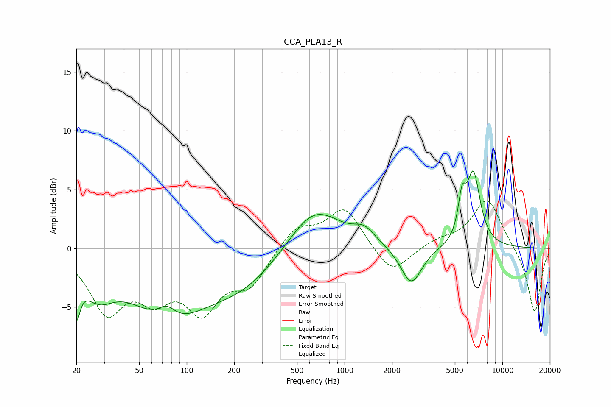

# CCA_PLA13_R
See [usage instructions](https://github.com/jaakkopasanen/AutoEq#usage) for more options and info.

### Parametric EQs
Apply preamp of -6.7 dB when using parametric equalizer.

|   # | Type    |   Fc (Hz) |    Q |   Gain (dB) |
|-----|---------|-----------|------|-------------|
|   1 | Peaking |        20 | 5.99 |        -3.5 |
|   2 | Peaking |        27 | 1.39 |        -2.7 |
|   3 | Peaking |        75 | 2.55 |         1.3 |
|   4 | Peaking |        76 | 0.59 |        -5.3 |
|   5 | Peaking |       231 | 0.6  |        -2.6 |
|   6 | Peaking |       642 | 0.86 |         3.8 |
|   7 | Peaking |      1334 | 2.12 |         1.1 |
|   8 | Peaking |      2648 | 2.12 |        -3.3 |
|   9 | Peaking |      5546 | 5.86 |         3   |
|  10 | Peaking |      6548 | 3.14 |         6.2 |

### Fixed Band EQs
When using fixed band (also called graphic) equalizer, apply preamp of **-4.1 dB** (if available) and set gains manually with these parameters.

|   # | Type    |   Fc (Hz) |    Q |   Gain (dB) |
|-----|---------|-----------|------|-------------|
|   1 | Peaking |        31 | 1.41 |        -5.1 |
|   2 | Peaking |        62 | 1.41 |        -3.3 |
|   3 | Peaking |       125 | 1.41 |        -4.7 |
|   4 | Peaking |       250 | 1.41 |        -2.8 |
|   5 | Peaking |       500 | 1.41 |         1.9 |
|   6 | Peaking |      1000 | 1.41 |         3.4 |
|   7 | Peaking |      2000 | 1.41 |        -2.4 |
|   8 | Peaking |      4000 | 1.41 |         0.6 |
|   9 | Peaking |      8000 | 1.41 |         4.3 |
|  10 | Peaking |     16000 | 1.41 |        -5.6 |

### Graphs

