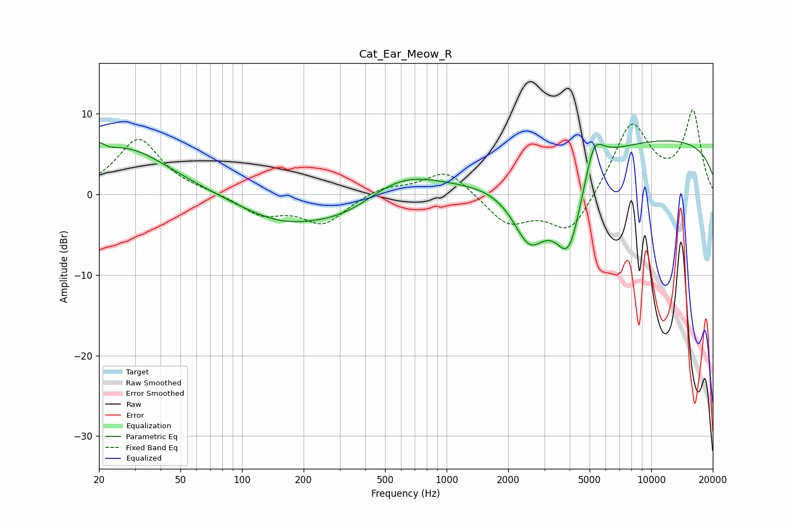

# Cat_Ear_Meow_R
See [usage instructions](https://github.com/jaakkopasanen/AutoEq#usage) for more options and info.

### Parametric EQs
Apply preamp of -6.7 dB when using parametric equalizer.

|   # | Type    |   Fc (Hz) |    Q |   Gain (dB) |
|-----|---------|-----------|------|-------------|
|   1 | Peaking |        20 | 5.86 |         1.3 |
|   2 | Peaking |        26 | 0.63 |         5.9 |
|   3 | Peaking |       156 | 0.65 |        -3.2 |
|   4 | Peaking |       327 | 0.79 |        -2.2 |
|   5 | Peaking |       595 | 0.77 |         2.9 |
|   6 | Peaking |      2543 | 1.61 |        -7.6 |
|   7 | Peaking |      3965 | 1.77 |       -11.4 |
|   8 | Peaking |      5233 | 1.92 |         3.3 |
|   9 | Peaking |      5245 | 3.97 |         2.3 |
|  10 | Peaking |     10000 | 0.18 |         7   |

### Fixed Band EQs
When using fixed band (also called graphic) equalizer, apply preamp of **-10.5 dB** (if available) and set gains manually with these parameters.

|   # | Type    |   Fc (Hz) |    Q |   Gain (dB) |
|-----|---------|-----------|------|-------------|
|   1 | Peaking |        31 | 1.41 |         6.9 |
|   2 | Peaking |        62 | 1.41 |         0.2 |
|   3 | Peaking |       125 | 1.41 |        -2.4 |
|   4 | Peaking |       250 | 1.41 |        -3.5 |
|   5 | Peaking |       500 | 1.41 |         1   |
|   6 | Peaking |      1000 | 1.41 |         3.2 |
|   7 | Peaking |      2000 | 1.41 |        -3.6 |
|   8 | Peaking |      4000 | 1.41 |        -5   |
|   9 | Peaking |      8000 | 1.41 |         8.9 |
|  10 | Peaking |     16000 | 1.41 |        10.1 |

### Graphs

