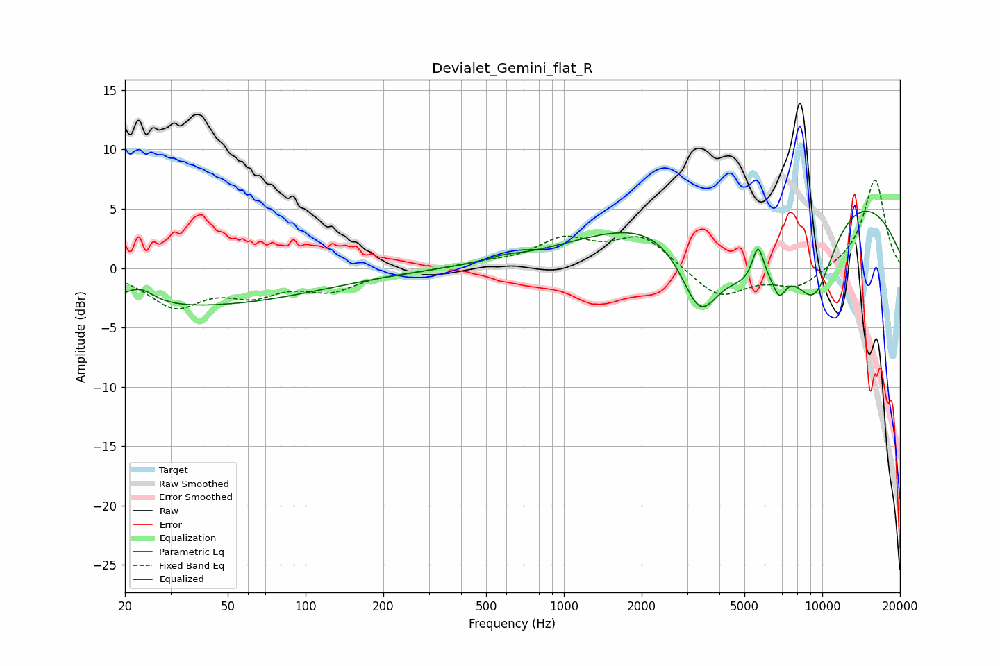

# Devialet_Gemini_flat_R
See [usage instructions](https://github.com/jaakkopasanen/AutoEq#usage) for more options and info.

### Parametric EQs
Apply preamp of -4.9 dB when using parametric equalizer.

|   # | Type    |   Fc (Hz) |    Q |   Gain (dB) |
|-----|---------|-----------|------|-------------|
|   1 | Peaking |        22 | 3.65 |        -1.3 |
|   2 | Peaking |        22 | 2.81 |         2.9 |
|   3 | Peaking |        25 | 0.21 |        -3.4 |
|   4 | Peaking |       585 | 2.48 |         0.3 |
|   5 | Peaking |      3354 | 1.77 |        -6.7 |
|   6 | Peaking |      5414 | 0.87 |        -6.9 |
|   7 | Peaking |      5645 | 5.99 |         3.2 |
|   8 | Peaking |      6825 | 5.51 |        -1.9 |
|   9 | Peaking |      7156 | 0.2  |         8.8 |
|  10 | Peaking |      9328 | 1.42 |        -7.7 |

### Fixed Band EQs
When using fixed band (also called graphic) equalizer, apply preamp of **-7.5 dB** (if available) and set gains manually with these parameters.

|   # | Type    |   Fc (Hz) |    Q |   Gain (dB) |
|-----|---------|-----------|------|-------------|
|   1 | Peaking |        31 | 1.41 |        -3   |
|   2 | Peaking |        62 | 1.41 |        -1.8 |
|   3 | Peaking |       125 | 1.41 |        -1.6 |
|   4 | Peaking |       250 | 1.41 |        -0.2 |
|   5 | Peaking |       500 | 1.41 |         0.3 |
|   6 | Peaking |      1000 | 1.41 |         2.3 |
|   7 | Peaking |      2000 | 1.41 |         2.6 |
|   8 | Peaking |      4000 | 1.41 |        -2.5 |
|   9 | Peaking |      8000 | 1.41 |        -1.6 |
|  10 | Peaking |     16000 | 1.41 |         7.5 |

### Graphs

