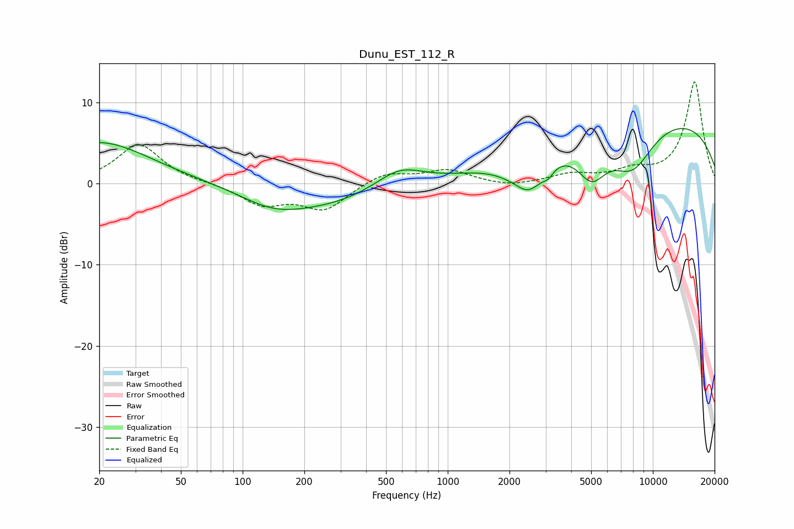

# Dunu_EST_112_R
See [usage instructions](https://github.com/jaakkopasanen/AutoEq#usage) for more options and info.

### Parametric EQs
Apply preamp of -6.9 dB when using parametric equalizer.

|   # | Type    |   Fc (Hz) |    Q |   Gain (dB) |
|-----|---------|-----------|------|-------------|
|   1 | Peaking |        20 | 0.57 |         5.2 |
|   2 | Peaking |       140 | 0.88 |        -2.1 |
|   3 | Peaking |       264 | 0.56 |        -2.2 |
|   4 | Peaking |       580 | 1.23 |         2.4 |
|   5 | Peaking |      1894 | 1.7  |        -0.5 |
|   6 | Peaking |      2491 | 1.81 |        -4.2 |
|   7 | Peaking |      3090 | 5.43 |        -0.9 |
|   8 | Peaking |      5033 | 1.92 |        -4.6 |
|   9 | Peaking |      7929 | 1.21 |        -5.7 |
|  10 | Peaking |      9513 | 0.21 |         8.5 |

### Fixed Band EQs
When using fixed band (also called graphic) equalizer, apply preamp of **-12.6 dB** (if available) and set gains manually with these parameters.

|   # | Type    |   Fc (Hz) |    Q |   Gain (dB) |
|-----|---------|-----------|------|-------------|
|   1 | Peaking |        31 | 1.41 |         4.9 |
|   2 | Peaking |        62 | 1.41 |         0.1 |
|   3 | Peaking |       125 | 1.41 |        -2.5 |
|   4 | Peaking |       250 | 1.41 |        -3.1 |
|   5 | Peaking |       500 | 1.41 |         1.4 |
|   6 | Peaking |      1000 | 1.41 |         1.6 |
|   7 | Peaking |      2000 | 1.41 |        -0.5 |
|   8 | Peaking |      4000 | 1.41 |         1.1 |
|   9 | Peaking |      8000 | 1.41 |         1.3 |
|  10 | Peaking |     16000 | 1.41 |        12.6 |

### Graphs

