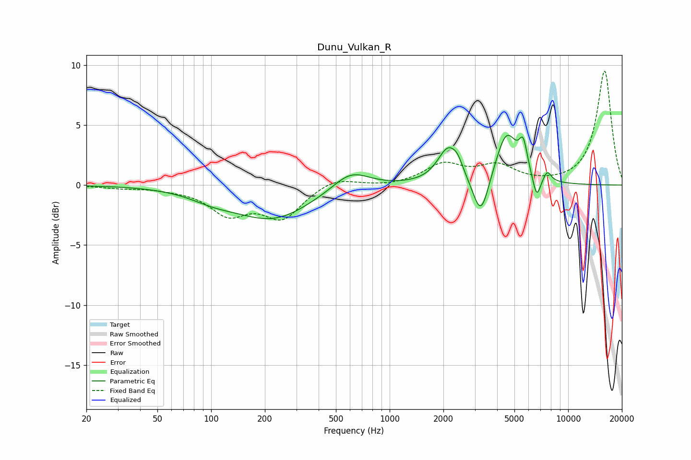

# Dunu_Vulkan_R
See [usage instructions](https://github.com/jaakkopasanen/AutoEq#usage) for more options and info.

### Parametric EQs
Apply preamp of -4.2 dB when using parametric equalizer.

|   # | Type    |   Fc (Hz) |    Q |   Gain (dB) |
|-----|---------|-----------|------|-------------|
|   1 | Peaking |       103 | 1.07 |        -0.7 |
|   2 | Peaking |       222 | 0.66 |        -2.8 |
|   3 | Peaking |       605 | 1.37 |         1.6 |
|   4 | Peaking |      2129 | 2.4  |         2.9 |
|   5 | Peaking |      2411 | 4.94 |         0.7 |
|   6 | Peaking |      3245 | 3.18 |        -3.6 |
|   7 | Peaking |      4518 | 2.27 |         4.3 |
|   8 | Peaking |      5603 | 5.99 |         2.3 |
|   9 | Peaking |      6663 | 6    |        -1.9 |
|  10 | Peaking |      7637 | 5.99 |         0.9 |

### Fixed Band EQs
When using fixed band (also called graphic) equalizer, apply preamp of **-9.6 dB** (if available) and set gains manually with these parameters.

|   # | Type    |   Fc (Hz) |    Q |   Gain (dB) |
|-----|---------|-----------|------|-------------|
|   1 | Peaking |        31 | 1.41 |        -0.2 |
|   2 | Peaking |        62 | 1.41 |        -0.2 |
|   3 | Peaking |       125 | 1.41 |        -2.2 |
|   4 | Peaking |       250 | 1.41 |        -2.6 |
|   5 | Peaking |       500 | 1.41 |         0.7 |
|   6 | Peaking |      1000 | 1.41 |        -0.1 |
|   7 | Peaking |      2000 | 1.41 |         1.6 |
|   8 | Peaking |      4000 | 1.41 |         1.5 |
|   9 | Peaking |      8000 | 1.41 |         0   |
|  10 | Peaking |     16000 | 1.41 |         9.5 |

### Graphs

