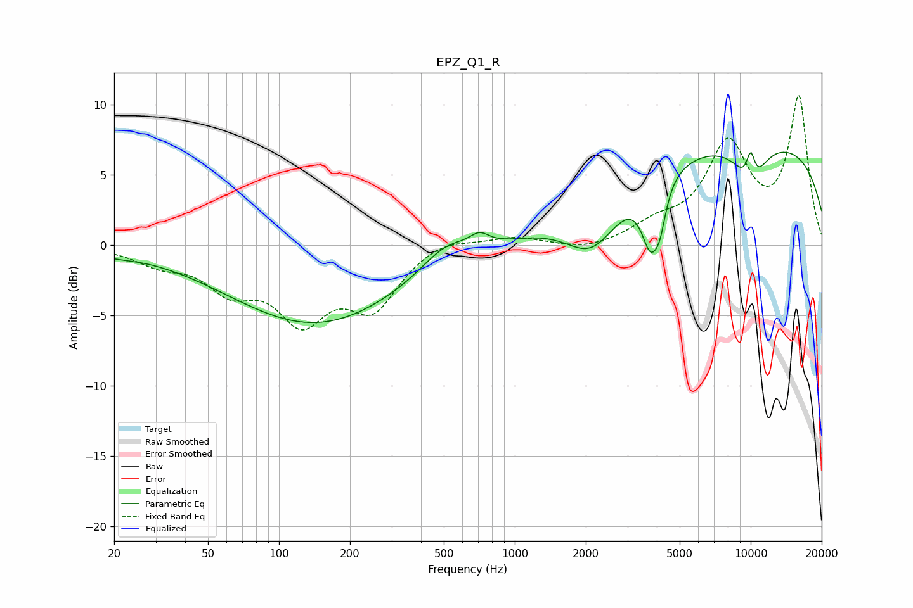

# EPZ_Q1_R
See [usage instructions](https://github.com/jaakkopasanen/AutoEq#usage) for more options and info.

### Parametric EQs
Apply preamp of -6.7 dB when using parametric equalizer.

|   # | Type    |   Fc (Hz) |    Q |   Gain (dB) |
|-----|---------|-----------|------|-------------|
|   1 | Peaking |        20 | 1.74 |        -0.3 |
|   2 | Peaking |       143 | 0.38 |        -5.6 |
|   3 | Peaking |       507 | 1.39 |         1.6 |
|   4 | Peaking |       708 | 3.58 |         0.9 |
|   5 | Peaking |      2132 | 1.21 |        -3.8 |
|   6 | Peaking |      3759 | 3.64 |        -4.3 |
|   7 | Peaking |      4125 | 5.53 |        -2   |
|   8 | Peaking |      9515 | 0.18 |         7.6 |
|   9 | Peaking |     10000 | 6    |         2.5 |
|  10 | Peaking |     10000 | 2.04 |        -3.3 |

### Fixed Band EQs
When using fixed band (also called graphic) equalizer, apply preamp of **-10.7 dB** (if available) and set gains manually with these parameters.

|   # | Type    |   Fc (Hz) |    Q |   Gain (dB) |
|-----|---------|-----------|------|-------------|
|   1 | Peaking |        31 | 1.41 |        -1.1 |
|   2 | Peaking |        62 | 1.41 |        -2.7 |
|   3 | Peaking |       125 | 1.41 |        -4.8 |
|   4 | Peaking |       250 | 1.41 |        -4.1 |
|   5 | Peaking |       500 | 1.41 |         0.7 |
|   6 | Peaking |      1000 | 1.41 |         0.6 |
|   7 | Peaking |      2000 | 1.41 |        -0.5 |
|   8 | Peaking |      4000 | 1.41 |         1.2 |
|   9 | Peaking |      8000 | 1.41 |         6.8 |
|  10 | Peaking |     16000 | 1.41 |        10.3 |

### Graphs

