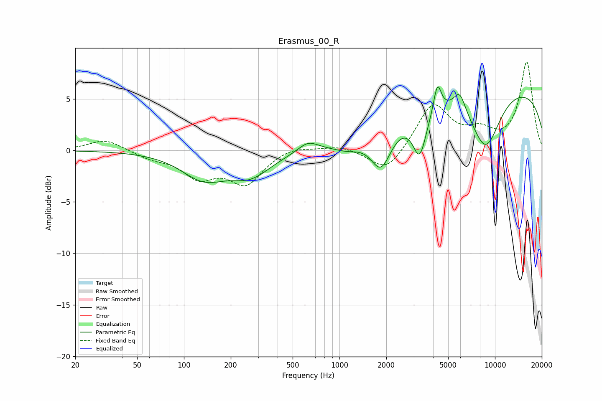

# Erasmus_00_R
See [usage instructions](https://github.com/jaakkopasanen/AutoEq#usage) for more options and info.

### Parametric EQs
Apply preamp of -6.3 dB when using parametric equalizer.

|   # | Type    |   Fc (Hz) |    Q |   Gain (dB) |
|-----|---------|-----------|------|-------------|
|   1 | Peaking |       134 | 0.99 |        -2.5 |
|   2 | Peaking |       268 | 1.07 |        -2.1 |
|   3 | Peaking |       628 | 2.21 |         1   |
|   4 | Peaking |      1133 | 1.59 |        -0.7 |
|   5 | Peaking |      1850 | 2.15 |        -3.7 |
|   6 | Peaking |      3280 | 3.24 |        -4.2 |
|   7 | Peaking |      4266 | 5.88 |         2.8 |
|   8 | Peaking |      5927 | 3.68 |         1.9 |
|   9 | Peaking |      8692 | 1.32 |        -5.8 |
|  10 | Peaking |     10000 | 0.18 |         6.4 |

### Fixed Band EQs
When using fixed band (also called graphic) equalizer, apply preamp of **-8.7 dB** (if available) and set gains manually with these parameters.

|   # | Type    |   Fc (Hz) |    Q |   Gain (dB) |
|-----|---------|-----------|------|-------------|
|   1 | Peaking |        31 | 1.41 |         1.1 |
|   2 | Peaking |        62 | 1.41 |        -0.7 |
|   3 | Peaking |       125 | 1.41 |        -2.4 |
|   4 | Peaking |       250 | 1.41 |        -3.1 |
|   5 | Peaking |       500 | 1.41 |         0.5 |
|   6 | Peaking |      1000 | 1.41 |         0.5 |
|   7 | Peaking |      2000 | 1.41 |        -2.3 |
|   8 | Peaking |      4000 | 1.41 |         4.5 |
|   9 | Peaking |      8000 | 1.41 |         1.5 |
|  10 | Peaking |     16000 | 1.41 |         8.5 |

### Graphs

