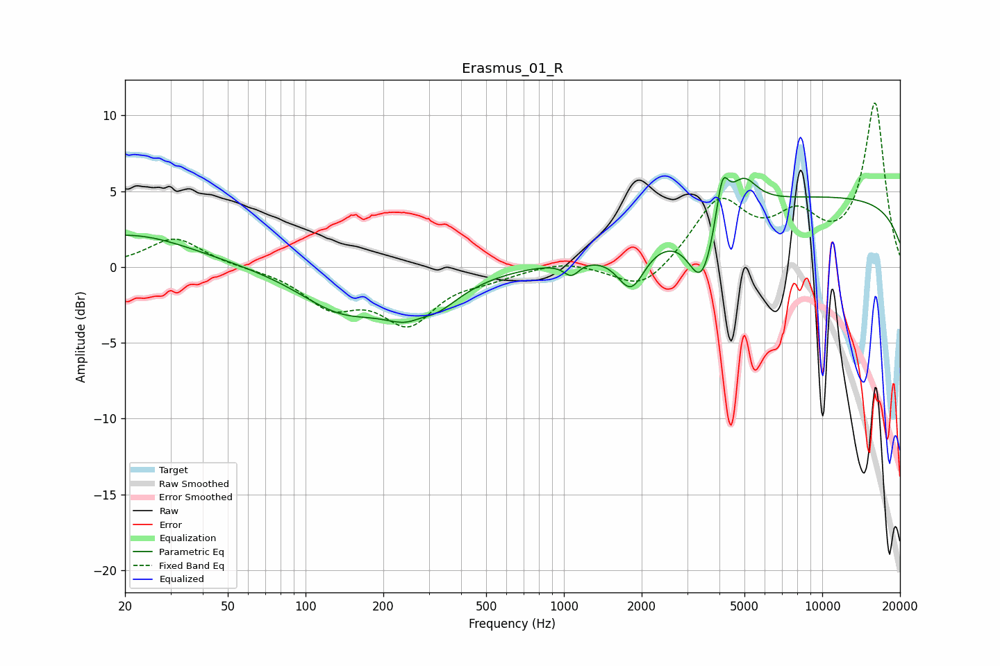

# Erasmus_01_R
See [usage instructions](https://github.com/jaakkopasanen/AutoEq#usage) for more options and info.

### Parametric EQs
Apply preamp of -6.0 dB when using parametric equalizer.

|   # | Type    |   Fc (Hz) |    Q |   Gain (dB) |
|-----|---------|-----------|------|-------------|
|   1 | Peaking |        21 | 0.57 |         2.2 |
|   2 | Peaking |       137 | 0.86 |        -2.6 |
|   3 | Peaking |       278 | 1.28 |        -3.7 |
|   4 | Peaking |       280 | 2.4  |         1.2 |
|   5 | Peaking |      1069 | 4.74 |        -0.9 |
|   6 | Peaking |      1821 | 2.63 |        -2.9 |
|   7 | Peaking |      3421 | 2.65 |        -4.3 |
|   8 | Peaking |      4104 | 5.85 |         3.2 |
|   9 | Peaking |      4935 | 2.62 |         2.2 |
|  10 | Peaking |     10000 | 0.18 |         4.6 |

### Fixed Band EQs
When using fixed band (also called graphic) equalizer, apply preamp of **-10.9 dB** (if available) and set gains manually with these parameters.

|   # | Type    |   Fc (Hz) |    Q |   Gain (dB) |
|-----|---------|-----------|------|-------------|
|   1 | Peaking |        31 | 1.41 |         2   |
|   2 | Peaking |        62 | 1.41 |        -0   |
|   3 | Peaking |       125 | 1.41 |        -2.3 |
|   4 | Peaking |       250 | 1.41 |        -3.4 |
|   5 | Peaking |       500 | 1.41 |        -0.5 |
|   6 | Peaking |      1000 | 1.41 |         0.5 |
|   7 | Peaking |      2000 | 1.41 |        -1.8 |
|   8 | Peaking |      4000 | 1.41 |         4.3 |
|   9 | Peaking |      8000 | 1.41 |         2.8 |
|  10 | Peaking |     16000 | 1.41 |        10.7 |

### Graphs

