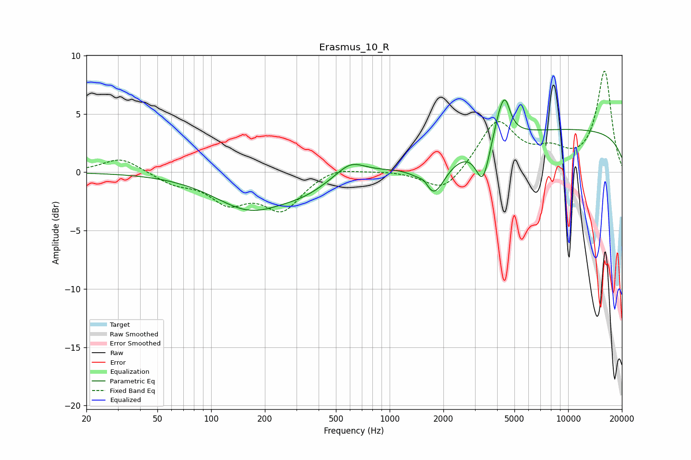

# Erasmus_10_R
See [usage instructions](https://github.com/jaakkopasanen/AutoEq#usage) for more options and info.

### Parametric EQs
Apply preamp of -6.3 dB when using parametric equalizer.

|   # | Type    |   Fc (Hz) |    Q |   Gain (dB) |
|-----|---------|-----------|------|-------------|
|   1 | Peaking |       166 | 0.7  |        -3.1 |
|   2 | Peaking |       334 | 1.07 |        -0.9 |
|   3 | Peaking |       604 | 1.79 |         1.2 |
|   4 | Peaking |      1570 | 4.58 |         0.8 |
|   5 | Peaking |      1745 | 2.14 |        -3.4 |
|   6 | Peaking |      3328 | 3.63 |        -3.5 |
|   7 | Peaking |      4228 | 3.37 |         2.9 |
|   8 | Peaking |      4470 | 5.99 |        -0.8 |
|   9 | Peaking |      4472 | 5.92 |         2.1 |
|  10 | Peaking |     10000 | 0.18 |         3.7 |

### Fixed Band EQs
When using fixed band (also called graphic) equalizer, apply preamp of **-8.8 dB** (if available) and set gains manually with these parameters.

|   # | Type    |   Fc (Hz) |    Q |   Gain (dB) |
|-----|---------|-----------|------|-------------|
|   1 | Peaking |        31 | 1.41 |         1.3 |
|   2 | Peaking |        62 | 1.41 |        -0.9 |
|   3 | Peaking |       125 | 1.41 |        -2.3 |
|   4 | Peaking |       250 | 1.41 |        -3   |
|   5 | Peaking |       500 | 1.41 |         0.6 |
|   6 | Peaking |      1000 | 1.41 |         0.1 |
|   7 | Peaking |      2000 | 1.41 |        -1.9 |
|   8 | Peaking |      4000 | 1.41 |         4.3 |
|   9 | Peaking |      8000 | 1.41 |         1.4 |
|  10 | Peaking |     16000 | 1.41 |         8.6 |

### Graphs

