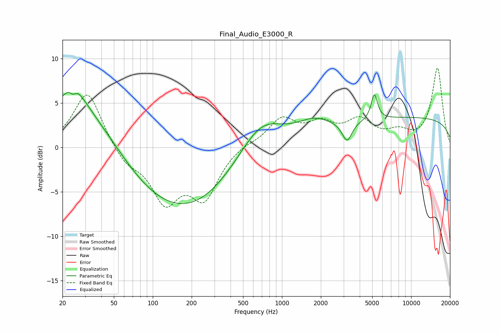

# Final_Audio_E3000_R
See [usage instructions](https://github.com/jaakkopasanen/AutoEq#usage) for more options and info.

### Parametric EQs
Apply preamp of -6.3 dB when using parametric equalizer.

|   # | Type    |   Fc (Hz) |    Q |   Gain (dB) |
|-----|---------|-----------|------|-------------|
|   1 | Peaking |        24 | 1.65 |         3.2 |
|   2 | Peaking |        24 | 5.94 |        -0.8 |
|   3 | Peaking |        32 | 0.44 |         6.9 |
|   4 | Peaking |        97 | 0.33 |        -6.8 |
|   5 | Peaking |       251 | 0.51 |        -2.4 |
|   6 | Peaking |       690 | 0.85 |         3.7 |
|   7 | Peaking |      1757 | 1.12 |         1.5 |
|   8 | Peaking |      3193 | 3.77 |        -2.2 |
|   9 | Peaking |      5191 | 5.73 |         2.9 |
|  10 | Peaking |     10000 | 0.18 |         3.3 |

### Fixed Band EQs
When using fixed band (also called graphic) equalizer, apply preamp of **-9.0 dB** (if available) and set gains manually with these parameters.

|   # | Type    |   Fc (Hz) |    Q |   Gain (dB) |
|-----|---------|-----------|------|-------------|
|   1 | Peaking |        31 | 1.41 |         6.4 |
|   2 | Peaking |        62 | 1.41 |        -1.8 |
|   3 | Peaking |       125 | 1.41 |        -5.7 |
|   4 | Peaking |       250 | 1.41 |        -5.3 |
|   5 | Peaking |       500 | 1.41 |         0.5 |
|   6 | Peaking |      1000 | 1.41 |         3.1 |
|   7 | Peaking |      2000 | 1.41 |         2.2 |
|   8 | Peaking |      4000 | 1.41 |         2.7 |
|   9 | Peaking |      8000 | 1.41 |         1.3 |
|  10 | Peaking |     16000 | 1.41 |         8.9 |

### Graphs

