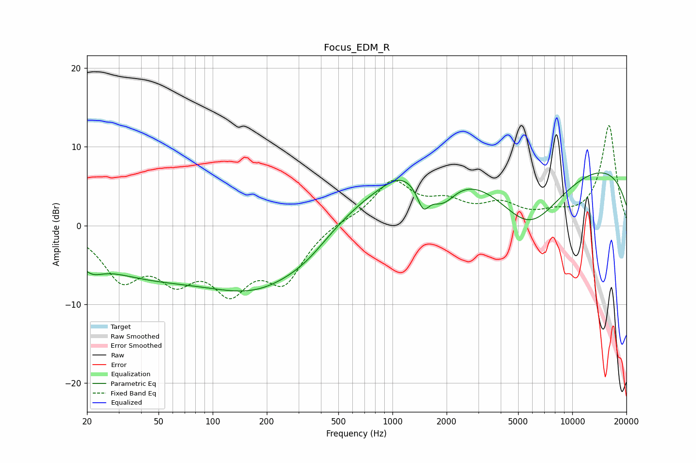

# Focus_EDM_R
See [usage instructions](https://github.com/jaakkopasanen/AutoEq#usage) for more options and info.

### Parametric EQs
Apply preamp of -6.8 dB when using parametric equalizer.

|   # | Type    |   Fc (Hz) |    Q |   Gain (dB) |
|-----|---------|-----------|------|-------------|
|   1 | Peaking |        21 | 2.16 |        -1.9 |
|   2 | Peaking |        38 | 0.44 |        -4.8 |
|   3 | Peaking |       193 | 0.42 |        -8.5 |
|   4 | Peaking |       335 | 1.07 |        -1.3 |
|   5 | Peaking |       963 | 0.29 |         5.8 |
|   6 | Peaking |      1095 | 1.63 |         1   |
|   7 | Peaking |      1482 | 4.17 |        -3   |
|   8 | Peaking |      1891 | 1.82 |        -3.7 |
|   9 | Peaking |      5735 | 0.7  |        -8.9 |
|  10 | Peaking |      9138 | 0.18 |         8.8 |

### Fixed Band EQs
When using fixed band (also called graphic) equalizer, apply preamp of **-12.8 dB** (if available) and set gains manually with these parameters.

|   # | Type    |   Fc (Hz) |    Q |   Gain (dB) |
|-----|---------|-----------|------|-------------|
|   1 | Peaking |        31 | 1.41 |        -6.1 |
|   2 | Peaking |        62 | 1.41 |        -5.4 |
|   3 | Peaking |       125 | 1.41 |        -6.9 |
|   4 | Peaking |       250 | 1.41 |        -6.4 |
|   5 | Peaking |       500 | 1.41 |         0.6 |
|   6 | Peaking |      1000 | 1.41 |         5.4 |
|   7 | Peaking |      2000 | 1.41 |         2.4 |
|   8 | Peaking |      4000 | 1.41 |         2.3 |
|   9 | Peaking |      8000 | 1.41 |         1.1 |
|  10 | Peaking |     16000 | 1.41 |        12.7 |

### Graphs

