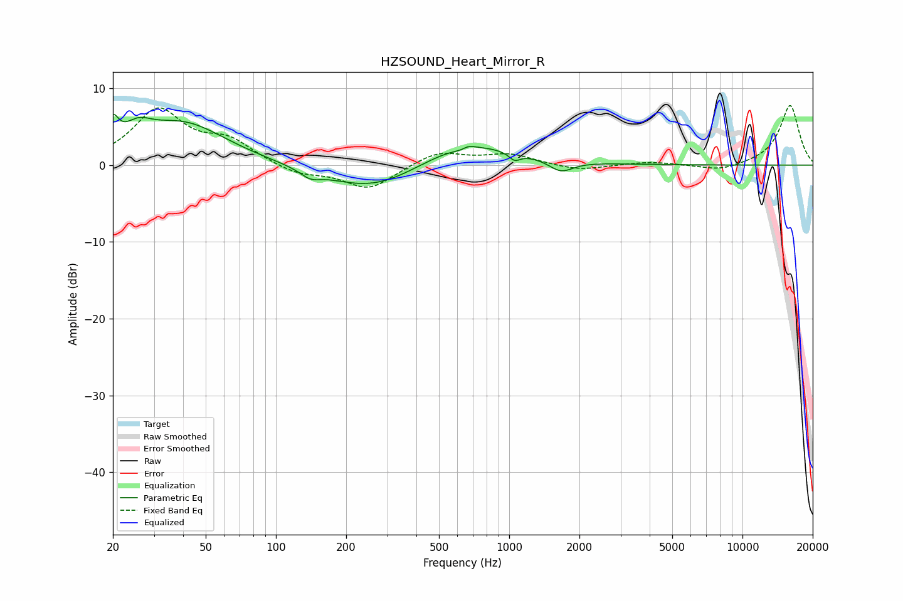

# HZSOUND_Heart_Mirror_R
See [usage instructions](https://github.com/jaakkopasanen/AutoEq#usage) for more options and info.

### Parametric EQs
Apply preamp of -6.7 dB when using parametric equalizer.

|   # | Type    |   Fc (Hz) |    Q |   Gain (dB) |
|-----|---------|-----------|------|-------------|
|   1 | Peaking |        20 | 5.94 |         3.3 |
|   2 | Peaking |        26 | 2.39 |         2.2 |
|   3 | Peaking |        40 | 0.75 |         5.4 |
|   4 | Peaking |       140 | 3.33 |        -1   |
|   5 | Peaking |       263 | 0.69 |        -3.6 |
|   6 | Peaking |       643 | 0.69 |         3.4 |
|   7 | Peaking |       651 | 4.21 |        -2.6 |
|   8 | Peaking |       657 | 4.47 |         2.7 |
|   9 | Peaking |      1055 | 5.95 |        -1   |
|  10 | Peaking |      1668 | 2.8  |        -1.5 |

### Fixed Band EQs
When using fixed band (also called graphic) equalizer, apply preamp of **-7.8 dB** (if available) and set gains manually with these parameters.

|   # | Type    |   Fc (Hz) |    Q |   Gain (dB) |
|-----|---------|-----------|------|-------------|
|   1 | Peaking |        31 | 1.41 |         7   |
|   2 | Peaking |        62 | 1.41 |         2.8 |
|   3 | Peaking |       125 | 1.41 |        -1.3 |
|   4 | Peaking |       250 | 1.41 |        -3.2 |
|   5 | Peaking |       500 | 1.41 |         1.8 |
|   6 | Peaking |      1000 | 1.41 |         1.4 |
|   7 | Peaking |      2000 | 1.41 |        -0.8 |
|   8 | Peaking |      4000 | 1.41 |         0.4 |
|   9 | Peaking |      8000 | 1.41 |        -0.9 |
|  10 | Peaking |     16000 | 1.41 |         7.8 |

### Graphs

