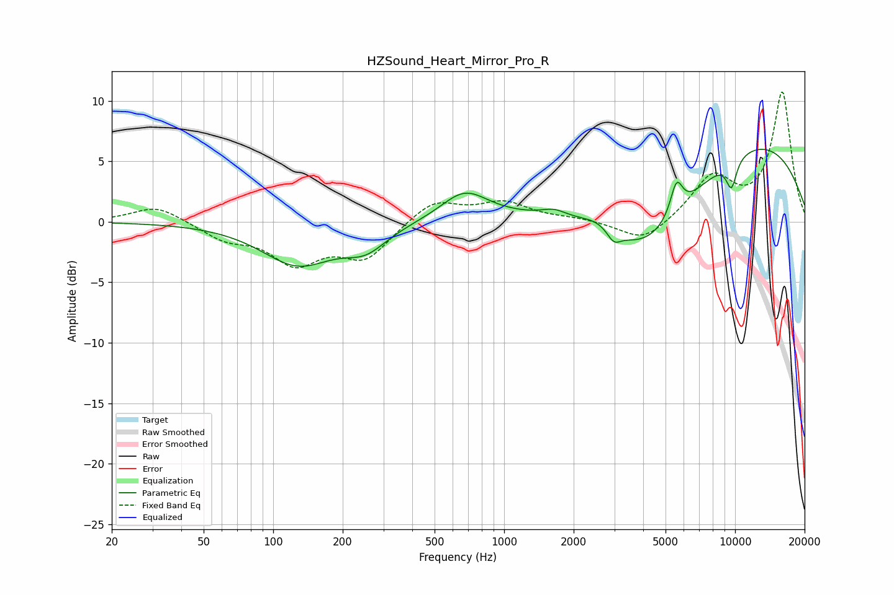

# HZSound_Heart_Mirror_Pro_R
See [usage instructions](https://github.com/jaakkopasanen/AutoEq#usage) for more options and info.

### Parametric EQs
Apply preamp of -6.1 dB when using parametric equalizer.

|   # | Type    |   Fc (Hz) |    Q |   Gain (dB) |
|-----|---------|-----------|------|-------------|
|   1 | Peaking |       128 | 0.91 |        -3.4 |
|   2 | Peaking |       252 | 1.52 |        -1.8 |
|   3 | Peaking |       674 | 1.39 |         2.4 |
|   4 | Peaking |      1645 | 2.67 |         0.6 |
|   5 | Peaking |      2582 | 1.67 |         1   |
|   6 | Peaking |      2983 | 4.85 |        -1   |
|   7 | Peaking |      4086 | 0.54 |        -9.6 |
|   8 | Peaking |      5578 | 5.14 |         2.7 |
|   9 | Peaking |      7710 | 0.22 |         9   |
|  10 | Peaking |      9646 | 5.45 |        -2.4 |

### Fixed Band EQs
When using fixed band (also called graphic) equalizer, apply preamp of **-10.8 dB** (if available) and set gains manually with these parameters.

|   # | Type    |   Fc (Hz) |    Q |   Gain (dB) |
|-----|---------|-----------|------|-------------|
|   1 | Peaking |        31 | 1.41 |         1.4 |
|   2 | Peaking |        62 | 1.41 |        -1.3 |
|   3 | Peaking |       125 | 1.41 |        -3.2 |
|   4 | Peaking |       250 | 1.41 |        -2.9 |
|   5 | Peaking |       500 | 1.41 |         1.8 |
|   6 | Peaking |      1000 | 1.41 |         1.5 |
|   7 | Peaking |      2000 | 1.41 |         0.2 |
|   8 | Peaking |      4000 | 1.41 |        -1.8 |
|   9 | Peaking |      8000 | 1.41 |         3.6 |
|  10 | Peaking |     16000 | 1.41 |        10.6 |

### Graphs

