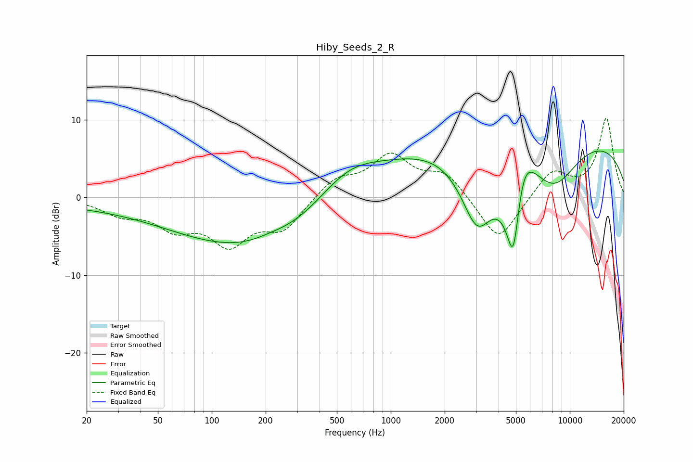

# Hiby_Seeds_2_R
See [usage instructions](https://github.com/jaakkopasanen/AutoEq#usage) for more options and info.

### Parametric EQs
Apply preamp of -6.1 dB when using parametric equalizer.

|   # | Type    |   Fc (Hz) |    Q |   Gain (dB) |
|-----|---------|-----------|------|-------------|
|   1 | Peaking |        22 | 0.25 |        -0.9 |
|   2 | Peaking |       175 | 0.33 |        -6.5 |
|   3 | Peaking |       212 | 1.49 |         0.5 |
|   4 | Peaking |       570 | 0.79 |         4   |
|   5 | Peaking |      2287 | 0.26 |         4.3 |
|   6 | Peaking |      3037 | 1.33 |       -10.9 |
|   7 | Peaking |      4844 | 2.43 |       -17.2 |
|   8 | Peaking |      5383 | 1.99 |         8.7 |
|   9 | Peaking |      8158 | 0.91 |        -7   |
|  10 | Peaking |      8735 | 0.18 |         8.1 |

### Fixed Band EQs
When using fixed band (also called graphic) equalizer, apply preamp of **-10.3 dB** (if available) and set gains manually with these parameters.

|   # | Type    |   Fc (Hz) |    Q |   Gain (dB) |
|-----|---------|-----------|------|-------------|
|   1 | Peaking |        31 | 1.41 |        -1.9 |
|   2 | Peaking |        62 | 1.41 |        -3.3 |
|   3 | Peaking |       125 | 1.41 |        -5.4 |
|   4 | Peaking |       250 | 1.41 |        -3.8 |
|   5 | Peaking |       500 | 1.41 |         2.4 |
|   6 | Peaking |      1000 | 1.41 |         5.1 |
|   7 | Peaking |      2000 | 1.41 |         3   |
|   8 | Peaking |      4000 | 1.41 |        -6   |
|   9 | Peaking |      8000 | 1.41 |         3.5 |
|  10 | Peaking |     16000 | 1.41 |        10.2 |

### Graphs

