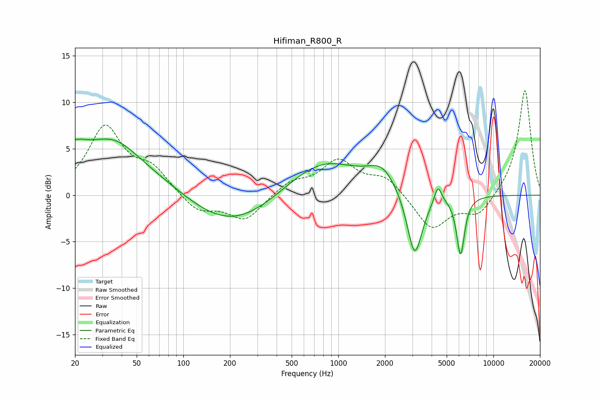

# Hifiman_R800_R
See [usage instructions](https://github.com/jaakkopasanen/AutoEq#usage) for more options and info.

### Parametric EQs
Apply preamp of -6.1 dB when using parametric equalizer.

|   # | Type    |   Fc (Hz) |    Q |   Gain (dB) |
|-----|---------|-----------|------|-------------|
|   1 | Peaking |        21 | 5.61 |         3.4 |
|   2 | Peaking |        21 | 5.99 |        -2.9 |
|   3 | Peaking |        23 | 0.31 |         5.3 |
|   4 | Peaking |        37 | 1.18 |         1.4 |
|   5 | Peaking |       202 | 0.51 |        -3.7 |
|   6 | Peaking |       787 | 0.59 |         3.9 |
|   7 | Peaking |      1919 | 1.54 |         2.3 |
|   8 | Peaking |      3108 | 2.85 |        -7.2 |
|   9 | Peaking |      4392 | 5.99 |         1.9 |
|  10 | Peaking |      6146 | 5.32 |        -6.3 |

### Fixed Band EQs
When using fixed band (also called graphic) equalizer, apply preamp of **-11.3 dB** (if available) and set gains manually with these parameters.

|   # | Type    |   Fc (Hz) |    Q |   Gain (dB) |
|-----|---------|-----------|------|-------------|
|   1 | Peaking |        31 | 1.41 |         7.2 |
|   2 | Peaking |        62 | 1.41 |         2.5 |
|   3 | Peaking |       125 | 1.41 |        -1.9 |
|   4 | Peaking |       250 | 1.41 |        -2.7 |
|   5 | Peaking |       500 | 1.41 |         1.4 |
|   6 | Peaking |      1000 | 1.41 |         3.5 |
|   7 | Peaking |      2000 | 1.41 |         1.9 |
|   8 | Peaking |      4000 | 1.41 |        -3.7 |
|   9 | Peaking |      8000 | 1.41 |        -2.2 |
|  10 | Peaking |     16000 | 1.41 |        11.5 |

### Graphs

