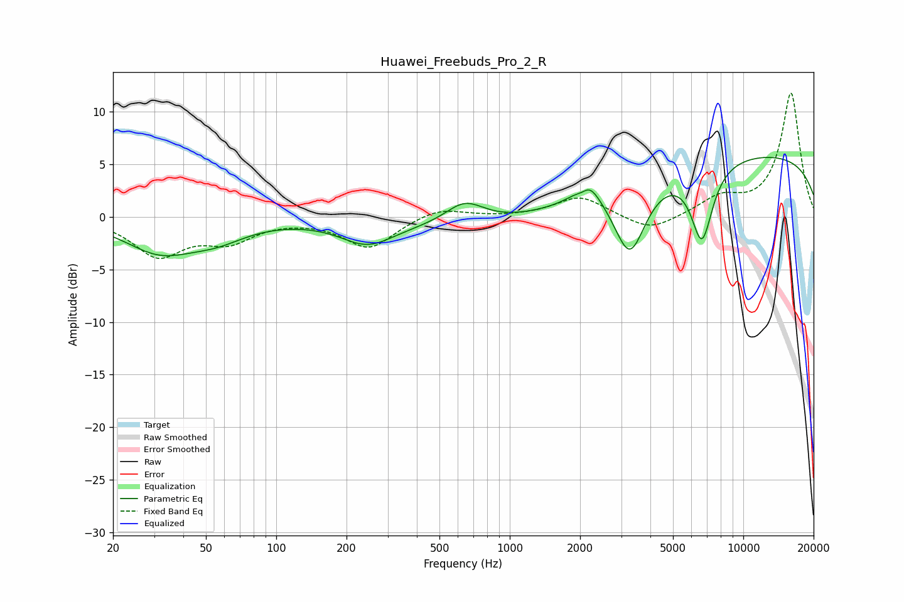

# Huawei_Freebuds_Pro_2_R
See [usage instructions](https://github.com/jaakkopasanen/AutoEq#usage) for more options and info.

### Parametric EQs
Apply preamp of -5.8 dB when using parametric equalizer.

|   # | Type    |   Fc (Hz) |    Q |   Gain (dB) |
|-----|---------|-----------|------|-------------|
|   1 | Peaking |        32 | 0.94 |        -3.1 |
|   2 | Peaking |        56 | 1.09 |        -1.5 |
|   3 | Peaking |       246 | 1.24 |        -2.2 |
|   4 | Peaking |       641 | 1.67 |         2.1 |
|   5 | Peaking |       845 | 0.35 |        -1.1 |
|   6 | Peaking |      2059 | 4.14 |        -1.5 |
|   7 | Peaking |      2122 | 2.84 |         3.3 |
|   8 | Peaking |      3269 | 2.04 |        -7.1 |
|   9 | Peaking |      6649 | 2.91 |        -7.3 |
|  10 | Peaking |     10000 | 0.18 |         6.1 |

### Fixed Band EQs
When using fixed band (also called graphic) equalizer, apply preamp of **-11.9 dB** (if available) and set gains manually with these parameters.

|   # | Type    |   Fc (Hz) |    Q |   Gain (dB) |
|-----|---------|-----------|------|-------------|
|   1 | Peaking |        31 | 1.41 |        -3.5 |
|   2 | Peaking |        62 | 1.41 |        -2   |
|   3 | Peaking |       125 | 1.41 |        -0.1 |
|   4 | Peaking |       250 | 1.41 |        -2.9 |
|   5 | Peaking |       500 | 1.41 |         1   |
|   6 | Peaking |      1000 | 1.41 |        -0   |
|   7 | Peaking |      2000 | 1.41 |         2   |
|   8 | Peaking |      4000 | 1.41 |        -1.5 |
|   9 | Peaking |      8000 | 1.41 |         1.7 |
|  10 | Peaking |     16000 | 1.41 |        11.8 |

### Graphs

