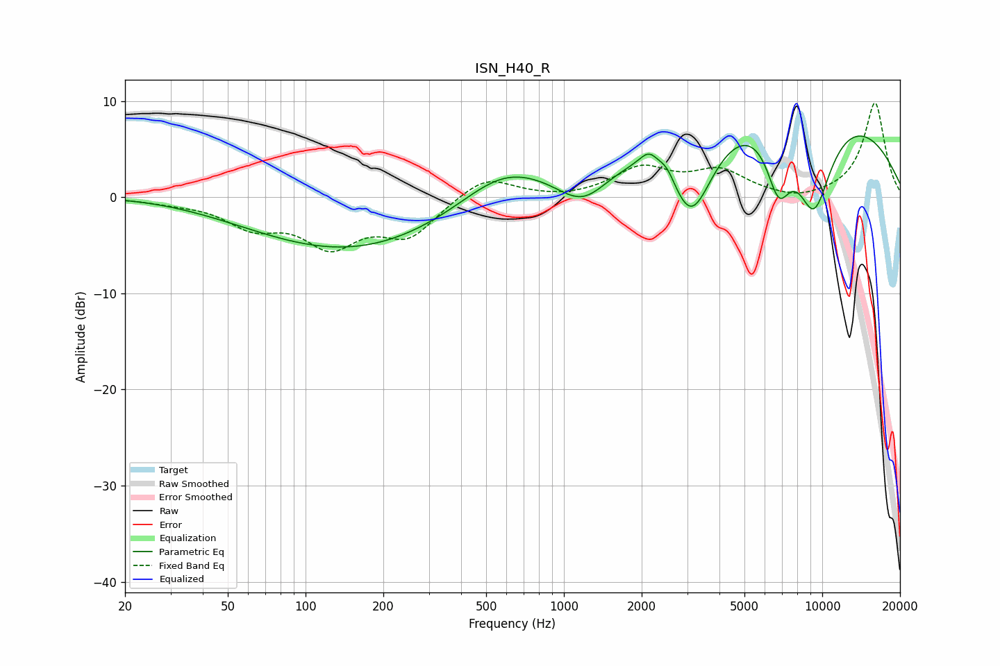

# ISN_H40_R
See [usage instructions](https://github.com/jaakkopasanen/AutoEq#usage) for more options and info.

### Parametric EQs
Apply preamp of -6.5 dB when using parametric equalizer.

|   # | Type    |   Fc (Hz) |    Q |   Gain (dB) |
|-----|---------|-----------|------|-------------|
|   1 | Peaking |        99 | 0.18 |         1.2 |
|   2 | Peaking |       148 | 0.33 |        -6.7 |
|   3 | Peaking |       577 | 0.84 |         3.3 |
|   4 | Peaking |      1186 | 1.31 |        -4.2 |
|   5 | Peaking |      2136 | 3.79 |         1.7 |
|   6 | Peaking |      2508 | 4.32 |         1.4 |
|   7 | Peaking |      3117 | 1.47 |       -10.4 |
|   8 | Peaking |      6594 | 0.22 |        12.1 |
|   9 | Peaking |      6780 | 2.77 |        -6.5 |
|  10 | Peaking |      9283 | 1.6  |       -11   |

### Fixed Band EQs
When using fixed band (also called graphic) equalizer, apply preamp of **-9.9 dB** (if available) and set gains manually with these parameters.

|   # | Type    |   Fc (Hz) |    Q |   Gain (dB) |
|-----|---------|-----------|------|-------------|
|   1 | Peaking |        31 | 1.41 |        -0.4 |
|   2 | Peaking |        62 | 1.41 |        -2.7 |
|   3 | Peaking |       125 | 1.41 |        -4.6 |
|   4 | Peaking |       250 | 1.41 |        -3.8 |
|   5 | Peaking |       500 | 1.41 |         2.3 |
|   6 | Peaking |      1000 | 1.41 |        -0.3 |
|   7 | Peaking |      2000 | 1.41 |         2.9 |
|   8 | Peaking |      4000 | 1.41 |         2.5 |
|   9 | Peaking |      8000 | 1.41 |        -0.6 |
|  10 | Peaking |     16000 | 1.41 |         9.8 |

### Graphs

