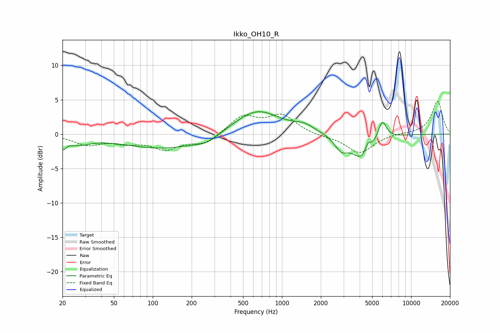

# Ikko_OH10_R
See [usage instructions](https://github.com/jaakkopasanen/AutoEq#usage) for more options and info.

### Parametric EQs
Apply preamp of -3.3 dB when using parametric equalizer.

|   # | Type    |   Fc (Hz) |    Q |   Gain (dB) |
|-----|---------|-----------|------|-------------|
|   1 | Peaking |        20 | 5.55 |        -1.4 |
|   2 | Peaking |        26 | 1.55 |        -1.1 |
|   3 | Peaking |       125 | 0.43 |        -2.1 |
|   4 | Peaking |       262 | 1.77 |        -0.8 |
|   5 | Peaking |       637 | 0.79 |         3.7 |
|   6 | Peaking |      1492 | 1.9  |         0.9 |
|   7 | Peaking |      2873 | 2.85 |        -1.8 |
|   8 | Peaking |      4206 | 1.7  |        -3.7 |
|   9 | Peaking |      4623 | 6    |         1.5 |
|  10 | Peaking |      5973 | 4.12 |         2.9 |

### Fixed Band EQs
When using fixed band (also called graphic) equalizer, apply preamp of **-4.9 dB** (if available) and set gains manually with these parameters.

|   # | Type    |   Fc (Hz) |    Q |   Gain (dB) |
|-----|---------|-----------|------|-------------|
|   1 | Peaking |        31 | 1.41 |        -1.4 |
|   2 | Peaking |        62 | 1.41 |        -1   |
|   3 | Peaking |       125 | 1.41 |        -2   |
|   4 | Peaking |       250 | 1.41 |        -1.4 |
|   5 | Peaking |       500 | 1.41 |         2.6 |
|   6 | Peaking |      1000 | 1.41 |         2.6 |
|   7 | Peaking |      2000 | 1.41 |        -0.3 |
|   8 | Peaking |      4000 | 1.41 |        -2.8 |
|   9 | Peaking |      8000 | 1.41 |         0.1 |
|  10 | Peaking |     16000 | 1.41 |         4.8 |

### Graphs

