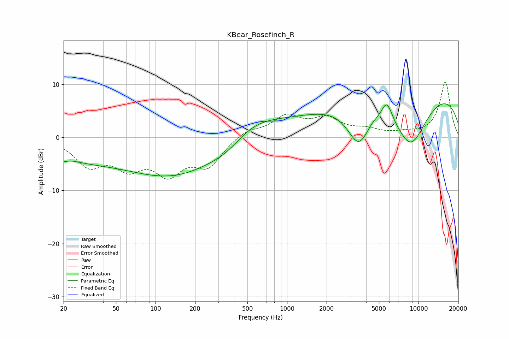

# KBear_Rosefinch_R
See [usage instructions](https://github.com/jaakkopasanen/AutoEq#usage) for more options and info.

### Parametric EQs
Apply preamp of -6.4 dB when using parametric equalizer.

|   # | Type    |   Fc (Hz) |    Q |   Gain (dB) |
|-----|---------|-----------|------|-------------|
|   1 | Peaking |        20 | 5.66 |        -0.8 |
|   2 | Peaking |        26 | 0.55 |        -2.8 |
|   3 | Peaking |       144 | 0.35 |        -7.6 |
|   4 | Peaking |       367 | 0.85 |        -3.6 |
|   5 | Peaking |       479 | 0.6  |         6.5 |
|   6 | Peaking |      3505 | 1.56 |        -7.9 |
|   7 | Peaking |      4448 | 3.54 |         0.4 |
|   8 | Peaking |      5746 | 3.37 |         3.7 |
|   9 | Peaking |      8531 | 0.18 |        10.8 |
|  10 | Peaking |      8708 | 0.89 |       -11.4 |

### Fixed Band EQs
When using fixed band (also called graphic) equalizer, apply preamp of **-10.5 dB** (if available) and set gains manually with these parameters.

|   # | Type    |   Fc (Hz) |    Q |   Gain (dB) |
|-----|---------|-----------|------|-------------|
|   1 | Peaking |        31 | 1.41 |        -4.8 |
|   2 | Peaking |        62 | 1.41 |        -4.7 |
|   3 | Peaking |       125 | 1.41 |        -6   |
|   4 | Peaking |       250 | 1.41 |        -4.9 |
|   5 | Peaking |       500 | 1.41 |         1.5 |
|   6 | Peaking |      1000 | 1.41 |         3.7 |
|   7 | Peaking |      2000 | 1.41 |         3.2 |
|   8 | Peaking |      4000 | 1.41 |         1.2 |
|   9 | Peaking |      8000 | 1.41 |         0.6 |
|  10 | Peaking |     16000 | 1.41 |        10.5 |

### Graphs

