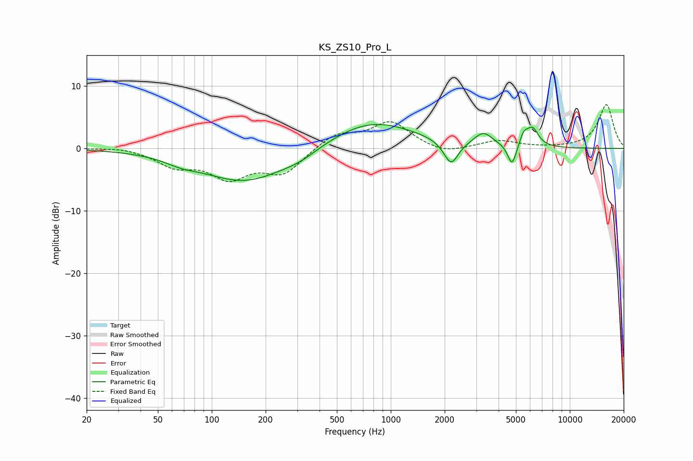

# KS_ZS10_Pro_L
See [usage instructions](https://github.com/jaakkopasanen/AutoEq#usage) for more options and info.

### Parametric EQs
Apply preamp of -3.9 dB when using parametric equalizer.

|   # | Type    |   Fc (Hz) |    Q |   Gain (dB) |
|-----|---------|-----------|------|-------------|
|   1 | Peaking |        68 | 1.61 |        -0.8 |
|   2 | Peaking |       155 | 0.58 |        -5.4 |
|   3 | Peaking |       311 | 1.47 |        -0.9 |
|   4 | Peaking |       776 | 0.58 |         4.5 |
|   5 | Peaking |      2136 | 2.95 |        -0.7 |
|   6 | Peaking |      2176 | 3.64 |        -3.2 |
|   7 | Peaking |      3292 | 2.76 |         2.1 |
|   8 | Peaking |      4759 | 5.86 |        -3.5 |
|   9 | Peaking |      5533 | 6    |         1.8 |
|  10 | Peaking |      6194 | 4.14 |         2.9 |

### Fixed Band EQs
When using fixed band (also called graphic) equalizer, apply preamp of **-7.1 dB** (if available) and set gains manually with these parameters.

|   # | Type    |   Fc (Hz) |    Q |   Gain (dB) |
|-----|---------|-----------|------|-------------|
|   1 | Peaking |        31 | 1.41 |         0.4 |
|   2 | Peaking |        62 | 1.41 |        -2.5 |
|   3 | Peaking |       125 | 1.41 |        -4.3 |
|   4 | Peaking |       250 | 1.41 |        -3.8 |
|   5 | Peaking |       500 | 1.41 |         2.4 |
|   6 | Peaking |      1000 | 1.41 |         4.1 |
|   7 | Peaking |      2000 | 1.41 |        -1   |
|   8 | Peaking |      4000 | 1.41 |         1.2 |
|   9 | Peaking |      8000 | 1.41 |         0   |
|  10 | Peaking |     16000 | 1.41 |         7   |

### Graphs

