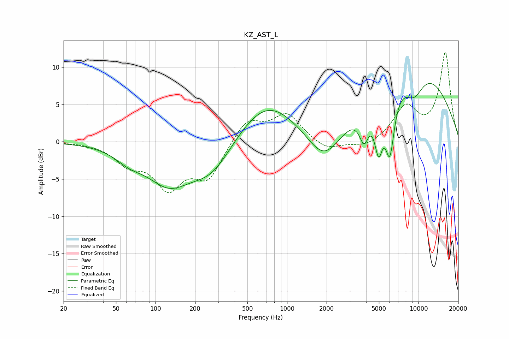

# KZ_AST_L
See [usage instructions](https://github.com/jaakkopasanen/AutoEq#usage) for more options and info.

### Parametric EQs
Apply preamp of -7.9 dB when using parametric equalizer.

|   # | Type    |   Fc (Hz) |    Q |   Gain (dB) |
|-----|---------|-----------|------|-------------|
|   1 | Peaking |        63 | 1.3  |        -1.5 |
|   2 | Peaking |       126 | 0.85 |        -5   |
|   3 | Peaking |       268 | 0.86 |        -4.3 |
|   4 | Peaking |       697 | 0.61 |         5.7 |
|   5 | Peaking |      1925 | 1.05 |        -5.3 |
|   6 | Peaking |      3853 | 3.81 |        -3.9 |
|   7 | Peaking |      4973 | 4.42 |        -6   |
|   8 | Peaking |      6055 | 3.77 |        -8.4 |
|   9 | Peaking |      8966 | 0.35 |        10.8 |
|  10 | Peaking |      9207 | 1.54 |        -4   |

### Fixed Band EQs
When using fixed band (also called graphic) equalizer, apply preamp of **-12.1 dB** (if available) and set gains manually with these parameters.

|   # | Type    |   Fc (Hz) |    Q |   Gain (dB) |
|-----|---------|-----------|------|-------------|
|   1 | Peaking |        31 | 1.41 |        -0   |
|   2 | Peaking |        62 | 1.41 |        -2.5 |
|   3 | Peaking |       125 | 1.41 |        -5.6 |
|   4 | Peaking |       250 | 1.41 |        -4.6 |
|   5 | Peaking |       500 | 1.41 |         3.1 |
|   6 | Peaking |      1000 | 1.41 |         3.6 |
|   7 | Peaking |      2000 | 1.41 |        -1.3 |
|   8 | Peaking |      4000 | 1.41 |        -0.9 |
|   9 | Peaking |      8000 | 1.41 |         4.4 |
|  10 | Peaking |     16000 | 1.41 |        11.8 |

### Graphs

