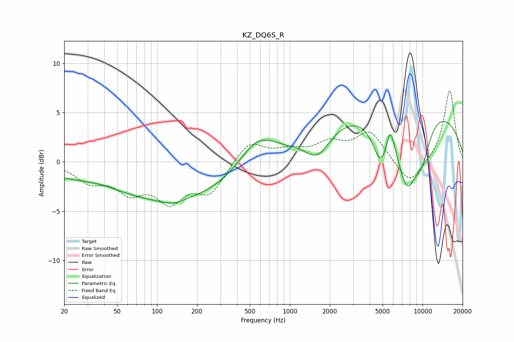

# KZ_DQ6S_R
See [usage instructions](https://github.com/jaakkopasanen/AutoEq#usage) for more options and info.

### Parametric EQs
Apply preamp of -4.2 dB when using parametric equalizer.

|   # | Type    |   Fc (Hz) |    Q |   Gain (dB) |
|-----|---------|-----------|------|-------------|
|   1 | Peaking |        38 | 0.83 |         0.9 |
|   2 | Peaking |       112 | 0.18 |        -4   |
|   3 | Peaking |       131 | 1.61 |        -0.6 |
|   4 | Peaking |       567 | 0.96 |         3.6 |
|   5 | Peaking |      1617 | 1.47 |        -2.6 |
|   6 | Peaking |      4853 | 2.16 |        -4.3 |
|   7 | Peaking |      5711 | 4.64 |         2.8 |
|   8 | Peaking |      7122 | 0.19 |         6.3 |
|   9 | Peaking |      7626 | 1.66 |        -6.9 |
|  10 | Peaking |      9886 | 1.89 |        -3.5 |

### Fixed Band EQs
When using fixed band (also called graphic) equalizer, apply preamp of **-7.3 dB** (if available) and set gains manually with these parameters.

|   # | Type    |   Fc (Hz) |    Q |   Gain (dB) |
|-----|---------|-----------|------|-------------|
|   1 | Peaking |        31 | 1.41 |        -1.8 |
|   2 | Peaking |        62 | 1.41 |        -2.6 |
|   3 | Peaking |       125 | 1.41 |        -3.5 |
|   4 | Peaking |       250 | 1.41 |        -2.9 |
|   5 | Peaking |       500 | 1.41 |         2.1 |
|   6 | Peaking |      1000 | 1.41 |         1   |
|   7 | Peaking |      2000 | 1.41 |         1.7 |
|   8 | Peaking |      4000 | 1.41 |         3   |
|   9 | Peaking |      8000 | 1.41 |        -2.5 |
|  10 | Peaking |     16000 | 1.41 |         7.4 |

### Graphs

