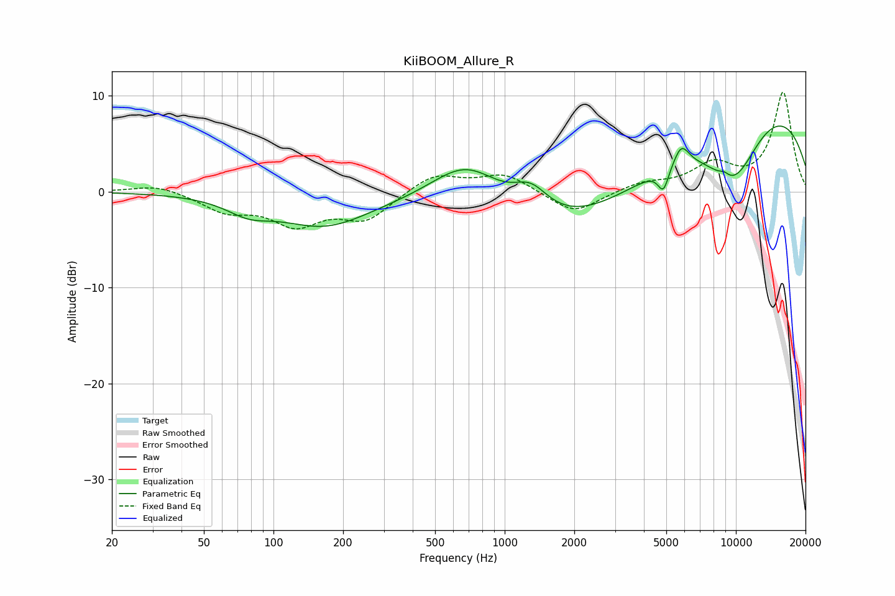

# KiiBOOM_Allure_R
See [usage instructions](https://github.com/jaakkopasanen/AutoEq#usage) for more options and info.

### Parametric EQs
Apply preamp of -6.9 dB when using parametric equalizer.

|   # | Type    |   Fc (Hz) |    Q |   Gain (dB) |
|-----|---------|-----------|------|-------------|
|   1 | Peaking |        78 | 1.46 |        -1.5 |
|   2 | Peaking |       165 | 0.73 |        -3.4 |
|   3 | Peaking |       690 | 0.83 |         6.3 |
|   4 | Peaking |      1299 | 1.79 |         2.9 |
|   5 | Peaking |      2110 | 0.28 |        -8.5 |
|   6 | Peaking |      4859 | 5.98 |        -2.4 |
|   7 | Peaking |      5810 | 4.12 |         2.1 |
|   8 | Peaking |      8901 | 5.92 |         0.5 |
|   9 | Peaking |      9174 | 0.21 |        11.4 |
|  10 | Peaking |      9764 | 1    |        -7.2 |

### Fixed Band EQs
When using fixed band (also called graphic) equalizer, apply preamp of **-10.5 dB** (if available) and set gains manually with these parameters.

|   # | Type    |   Fc (Hz) |    Q |   Gain (dB) |
|-----|---------|-----------|------|-------------|
|   1 | Peaking |        31 | 1.41 |         0.8 |
|   2 | Peaking |        62 | 1.41 |        -1.9 |
|   3 | Peaking |       125 | 1.41 |        -3.1 |
|   4 | Peaking |       250 | 1.41 |        -2.8 |
|   5 | Peaking |       500 | 1.41 |         1.9 |
|   6 | Peaking |      1000 | 1.41 |         1.8 |
|   7 | Peaking |      2000 | 1.41 |        -2.4 |
|   8 | Peaking |      4000 | 1.41 |         0.9 |
|   9 | Peaking |      8000 | 1.41 |         2.6 |
|  10 | Peaking |     16000 | 1.41 |        10.3 |

### Graphs

