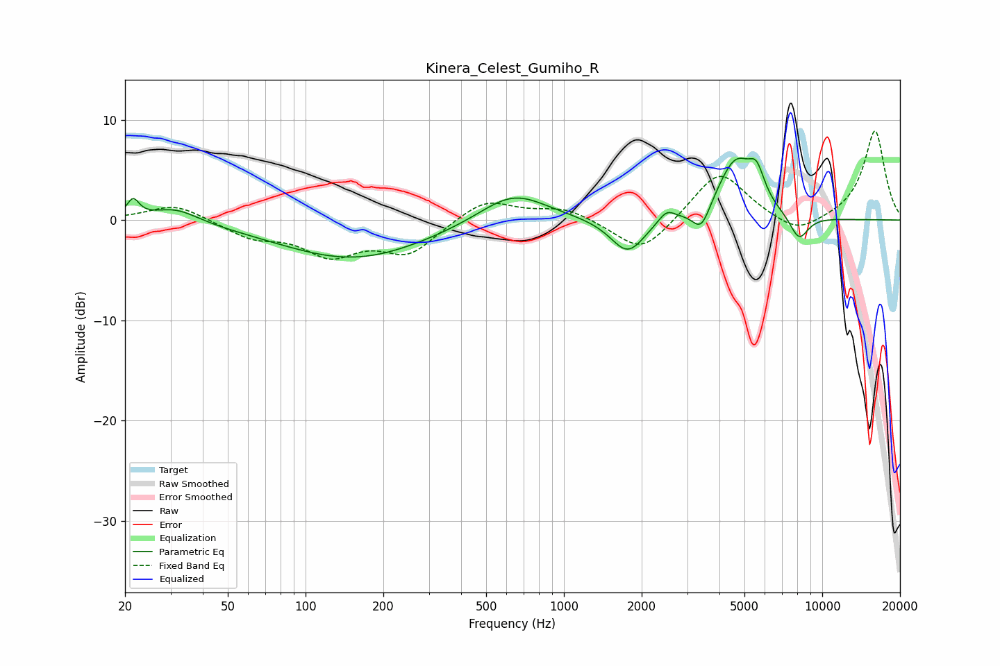

# Kinera_Celest_Gumiho_R
See [usage instructions](https://github.com/jaakkopasanen/AutoEq#usage) for more options and info.

### Parametric EQs
Apply preamp of -6.3 dB when using parametric equalizer.

|   # | Type    |   Fc (Hz) |    Q |   Gain (dB) |
|-----|---------|-----------|------|-------------|
|   1 | Peaking |        21 | 5.96 |         1.8 |
|   2 | Peaking |        31 | 1.53 |         1.5 |
|   3 | Peaking |       153 | 0.5  |        -3.9 |
|   4 | Peaking |       635 | 1.07 |         3.1 |
|   5 | Peaking |      1767 | 2.12 |        -3.5 |
|   6 | Peaking |      2498 | 4.33 |         1.2 |
|   7 | Peaking |      3406 | 4.01 |        -2.6 |
|   8 | Peaking |      4634 | 1.9  |         6   |
|   9 | Peaking |      5575 | 4.69 |         2.5 |
|  10 | Peaking |      8128 | 3.57 |        -2.5 |

### Fixed Band EQs
When using fixed band (also called graphic) equalizer, apply preamp of **-9.0 dB** (if available) and set gains manually with these parameters.

|   # | Type    |   Fc (Hz) |    Q |   Gain (dB) |
|-----|---------|-----------|------|-------------|
|   1 | Peaking |        31 | 1.41 |         1.7 |
|   2 | Peaking |        62 | 1.41 |        -1.6 |
|   3 | Peaking |       125 | 1.41 |        -3.2 |
|   4 | Peaking |       250 | 1.41 |        -3.2 |
|   5 | Peaking |       500 | 1.41 |         2.2 |
|   6 | Peaking |      1000 | 1.41 |         1.2 |
|   7 | Peaking |      2000 | 1.41 |        -3.5 |
|   8 | Peaking |      4000 | 1.41 |         5   |
|   9 | Peaking |      8000 | 1.41 |        -1.7 |
|  10 | Peaking |     16000 | 1.41 |         9   |

### Graphs

