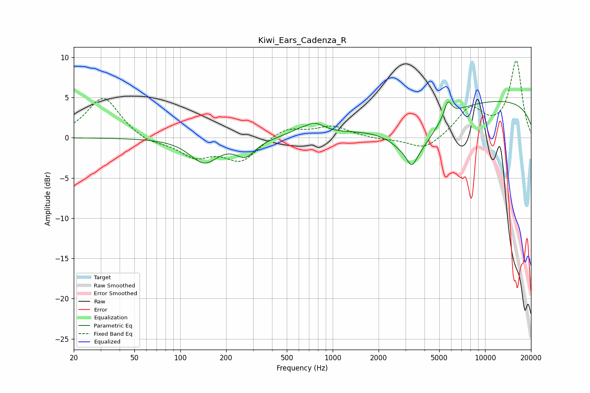

# Kiwi_Ears_Cadenza_R
See [usage instructions](https://github.com/jaakkopasanen/AutoEq#usage) for more options and info.

### Parametric EQs
Apply preamp of -4.6 dB when using parametric equalizer.

|   # | Type    |   Fc (Hz) |    Q |   Gain (dB) |
|-----|---------|-----------|------|-------------|
|   1 | Peaking |       139 | 2.51 |         0.4 |
|   2 | Peaking |       143 | 1.63 |        -3.4 |
|   3 | Peaking |       268 | 2.23 |        -2   |
|   4 | Peaking |       680 | 3.16 |        -0.6 |
|   5 | Peaking |       688 | 1.7  |         1.5 |
|   6 | Peaking |       744 | 2.44 |         0.7 |
|   7 | Peaking |      3301 | 4.73 |        -1.6 |
|   8 | Peaking |      3410 | 1.1  |        -5.3 |
|   9 | Peaking |      5698 | 5.46 |         2.1 |
|  10 | Peaking |     10000 | 0.18 |         4.8 |

### Fixed Band EQs
When using fixed band (also called graphic) equalizer, apply preamp of **-9.7 dB** (if available) and set gains manually with these parameters.

|   # | Type    |   Fc (Hz) |    Q |   Gain (dB) |
|-----|---------|-----------|------|-------------|
|   1 | Peaking |        31 | 1.41 |         5.1 |
|   2 | Peaking |        62 | 1.41 |        -0.8 |
|   3 | Peaking |       125 | 1.41 |        -2.2 |
|   4 | Peaking |       250 | 1.41 |        -2.8 |
|   5 | Peaking |       500 | 1.41 |         1.3 |
|   6 | Peaking |      1000 | 1.41 |         1.4 |
|   7 | Peaking |      2000 | 1.41 |        -0.2 |
|   8 | Peaking |      4000 | 1.41 |        -1.6 |
|   9 | Peaking |      8000 | 1.41 |         3.5 |
|  10 | Peaking |     16000 | 1.41 |         9.5 |

### Graphs

