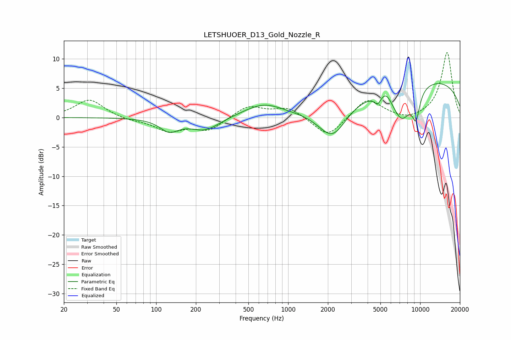

# LETSHUOER_D13_Gold_Nozzle_R
See [usage instructions](https://github.com/jaakkopasanen/AutoEq#usage) for more options and info.

### Parametric EQs
Apply preamp of -5.9 dB when using parametric equalizer.

|   # | Type    |   Fc (Hz) |    Q |   Gain (dB) |
|-----|---------|-----------|------|-------------|
|   1 | Peaking |       126 | 2.01 |        -2.1 |
|   2 | Peaking |       234 | 1.26 |        -2.2 |
|   3 | Peaking |       650 | 0.95 |         2.2 |
|   4 | Peaking |      2170 | 1.29 |        -5.7 |
|   5 | Peaking |      4748 | 5.92 |        -1.4 |
|   6 | Peaking |      5523 | 3.75 |         0.9 |
|   7 | Peaking |      5591 | 2.7  |         0.5 |
|   8 | Peaking |      7239 | 1.71 |        -6.1 |
|   9 | Peaking |      9310 | 4.43 |        -4.5 |
|  10 | Peaking |     10000 | 0.21 |         6.7 |

### Fixed Band EQs
When using fixed band (also called graphic) equalizer, apply preamp of **-11.1 dB** (if available) and set gains manually with these parameters.

|   # | Type    |   Fc (Hz) |    Q |   Gain (dB) |
|-----|---------|-----------|------|-------------|
|   1 | Peaking |        31 | 1.41 |         3.1 |
|   2 | Peaking |        62 | 1.41 |        -0.5 |
|   3 | Peaking |       125 | 1.41 |        -2.2 |
|   4 | Peaking |       250 | 1.41 |        -2.1 |
|   5 | Peaking |       500 | 1.41 |         2   |
|   6 | Peaking |      1000 | 1.41 |         1.7 |
|   7 | Peaking |      2000 | 1.41 |        -3.5 |
|   8 | Peaking |      4000 | 1.41 |         3.3 |
|   9 | Peaking |      8000 | 1.41 |        -0.7 |
|  10 | Peaking |     16000 | 1.41 |        11.1 |

### Graphs

