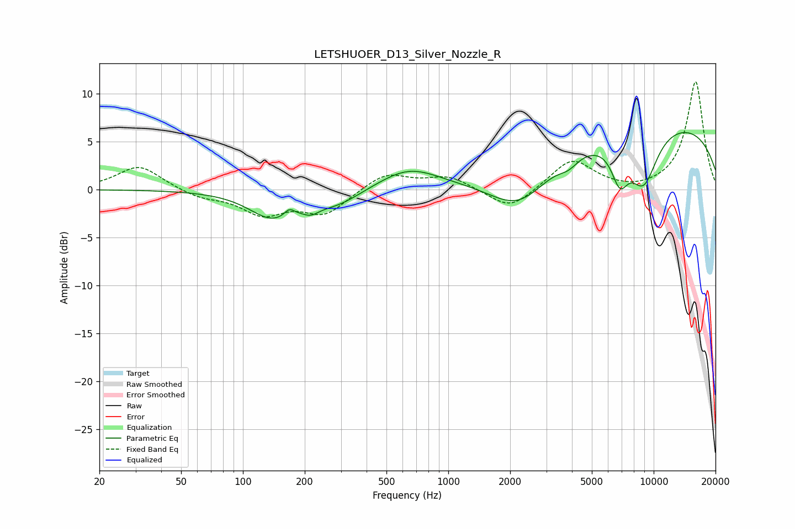

# LETSHUOER_D13_Silver_Nozzle_R
See [usage instructions](https://github.com/jaakkopasanen/AutoEq#usage) for more options and info.

### Parametric EQs
Apply preamp of -6.0 dB when using parametric equalizer.

|   # | Type    |   Fc (Hz) |    Q |   Gain (dB) |
|-----|---------|-----------|------|-------------|
|   1 | Peaking |       139 | 1.25 |        -2.8 |
|   2 | Peaking |       168 | 5.84 |         0.8 |
|   3 | Peaking |       214 | 3.55 |        -0.8 |
|   4 | Peaking |       287 | 1.15 |        -1.5 |
|   5 | Peaking |       642 | 0.95 |         2.2 |
|   6 | Peaking |      2216 | 0.96 |        -4.3 |
|   7 | Peaking |      3847 | 2.9  |        -0.9 |
|   8 | Peaking |      6842 | 3.23 |        -3.9 |
|   9 | Peaking |      8921 | 1.81 |        -5.8 |
|  10 | Peaking |     10000 | 0.21 |         7.2 |

### Fixed Band EQs
When using fixed band (also called graphic) equalizer, apply preamp of **-11.3 dB** (if available) and set gains manually with these parameters.

|   # | Type    |   Fc (Hz) |    Q |   Gain (dB) |
|-----|---------|-----------|------|-------------|
|   1 | Peaking |        31 | 1.41 |         2.5 |
|   2 | Peaking |        62 | 1.41 |        -0.8 |
|   3 | Peaking |       125 | 1.41 |        -2.4 |
|   4 | Peaking |       250 | 1.41 |        -2.5 |
|   5 | Peaking |       500 | 1.41 |         1.8 |
|   6 | Peaking |      1000 | 1.41 |         1.3 |
|   7 | Peaking |      2000 | 1.41 |        -2.3 |
|   8 | Peaking |      4000 | 1.41 |         3.2 |
|   9 | Peaking |      8000 | 1.41 |        -0.3 |
|  10 | Peaking |     16000 | 1.41 |        11.3 |

### Graphs

