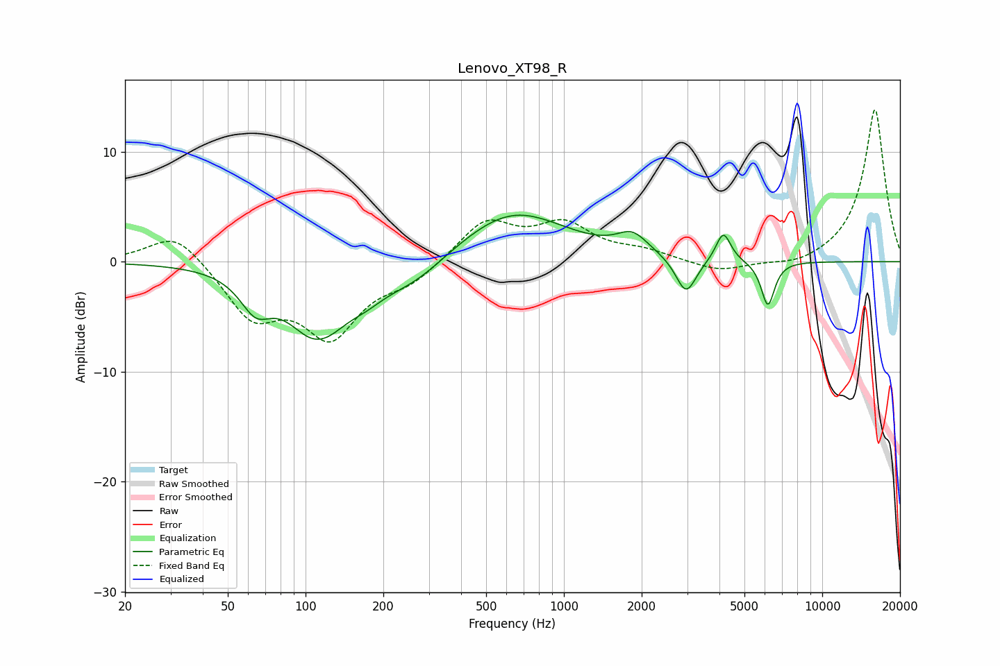

# Lenovo_XT98_R
See [usage instructions](https://github.com/jaakkopasanen/AutoEq#usage) for more options and info.

### Parametric EQs
Apply preamp of -4.3 dB when using parametric equalizer.

|   # | Type    |   Fc (Hz) |    Q |   Gain (dB) |
|-----|---------|-----------|------|-------------|
|   1 | Peaking |        64 | 2.38 |        -2.9 |
|   2 | Peaking |       111 | 1.3  |        -6.9 |
|   3 | Peaking |       112 | 2.61 |         0.6 |
|   4 | Peaking |       172 | 1.77 |        -1.2 |
|   5 | Peaking |       263 | 1.07 |        -2.1 |
|   6 | Peaking |       633 | 0.68 |         4.7 |
|   7 | Peaking |      1844 | 2.34 |         1.8 |
|   8 | Peaking |      2971 | 3.57 |        -3.4 |
|   9 | Peaking |      4142 | 4.88 |         2.7 |
|  10 | Peaking |      6160 | 5.35 |        -4.1 |

### Fixed Band EQs
When using fixed band (also called graphic) equalizer, apply preamp of **-13.9 dB** (if available) and set gains manually with these parameters.

|   # | Type    |   Fc (Hz) |    Q |   Gain (dB) |
|-----|---------|-----------|------|-------------|
|   1 | Peaking |        31 | 1.41 |         2.9 |
|   2 | Peaking |        62 | 1.41 |        -4.8 |
|   3 | Peaking |       125 | 1.41 |        -6.4 |
|   4 | Peaking |       250 | 1.41 |        -1.6 |
|   5 | Peaking |       500 | 1.41 |         3.7 |
|   6 | Peaking |      1000 | 1.41 |         3.1 |
|   7 | Peaking |      2000 | 1.41 |         0.8 |
|   8 | Peaking |      4000 | 1.41 |        -1   |
|   9 | Peaking |      8000 | 1.41 |        -0.6 |
|  10 | Peaking |     16000 | 1.41 |        13.9 |

### Graphs

