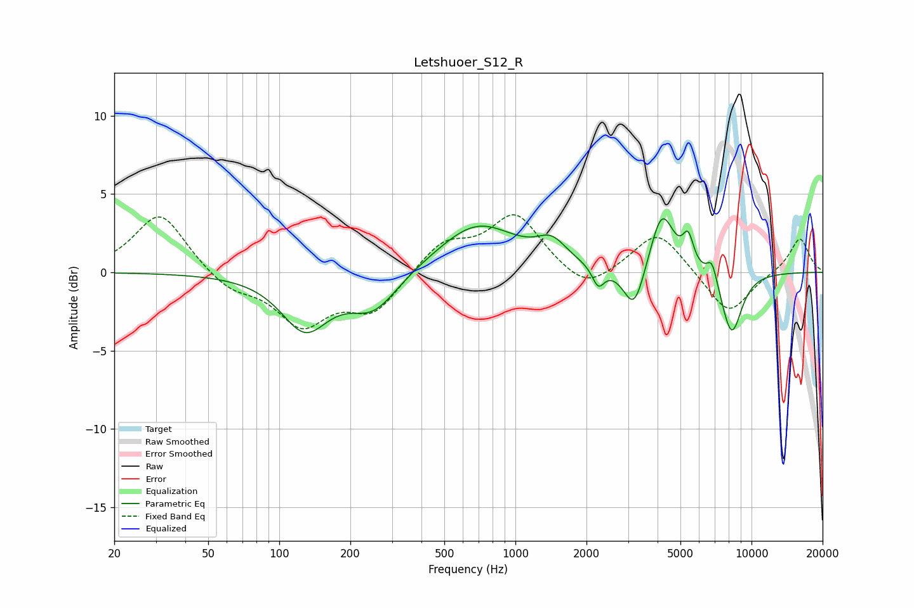

# Letshuoer_S12_R
See [usage instructions](https://github.com/jaakkopasanen/AutoEq#usage) for more options and info.

### Parametric EQs
Apply preamp of -3.5 dB when using parametric equalizer.

|   # | Type    |   Fc (Hz) |    Q |   Gain (dB) |
|-----|---------|-----------|------|-------------|
|   1 | Peaking |       128 | 1.42 |        -3.5 |
|   2 | Peaking |       251 | 1.36 |        -2.4 |
|   3 | Peaking |       690 | 0.85 |         3.1 |
|   4 | Peaking |      1425 | 2.26 |         1.3 |
|   5 | Peaking |      2243 | 5.59 |        -1.3 |
|   6 | Peaking |      3184 | 3.11 |        -3   |
|   7 | Peaking |      4174 | 2.76 |         4   |
|   8 | Peaking |      5392 | 6    |         1.8 |
|   9 | Peaking |      6804 | 6    |         1.4 |
|  10 | Peaking |      8237 | 2.94 |        -4   |

### Fixed Band EQs
When using fixed band (also called graphic) equalizer, apply preamp of **-3.8 dB** (if available) and set gains manually with these parameters.

|   # | Type    |   Fc (Hz) |    Q |   Gain (dB) |
|-----|---------|-----------|------|-------------|
|   1 | Peaking |        31 | 1.41 |         3.9 |
|   2 | Peaking |        62 | 1.41 |        -1.1 |
|   3 | Peaking |       125 | 1.41 |        -3.2 |
|   4 | Peaking |       250 | 1.41 |        -2.4 |
|   5 | Peaking |       500 | 1.41 |         1.9 |
|   6 | Peaking |      1000 | 1.41 |         3.6 |
|   7 | Peaking |      2000 | 1.41 |        -1.4 |
|   8 | Peaking |      4000 | 1.41 |         2.7 |
|   9 | Peaking |      8000 | 1.41 |        -2.8 |
|  10 | Peaking |     16000 | 1.41 |         2.2 |

### Graphs

