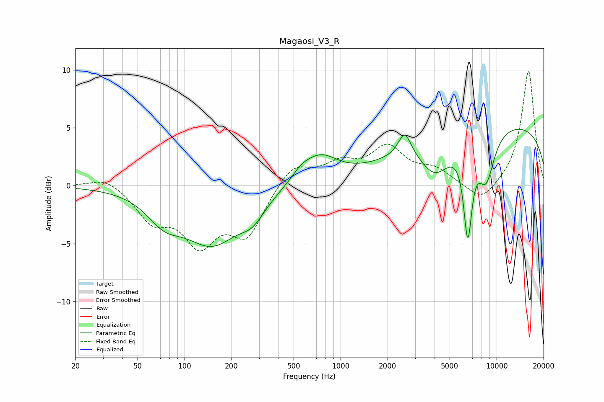

# Magaosi_V3_R
See [usage instructions](https://github.com/jaakkopasanen/AutoEq#usage) for more options and info.

### Parametric EQs
Apply preamp of -5.0 dB when using parametric equalizer.

|   # | Type    |   Fc (Hz) |    Q |   Gain (dB) |
|-----|---------|-----------|------|-------------|
|   1 | Peaking |        74 | 1.28 |        -2.1 |
|   2 | Peaking |       150 | 0.79 |        -4.7 |
|   3 | Peaking |       273 | 1.78 |        -1.5 |
|   4 | Peaking |       560 | 2.18 |         0.8 |
|   5 | Peaking |       742 | 1.28 |         2.2 |
|   6 | Peaking |      2578 | 3.43 |         2.2 |
|   7 | Peaking |      4051 | 1.42 |        -3.1 |
|   8 | Peaking |      6535 | 4.99 |        -7.7 |
|   9 | Peaking |      8549 | 2.36 |        -4.2 |
|  10 | Peaking |     10000 | 0.18 |         5.5 |

### Fixed Band EQs
When using fixed band (also called graphic) equalizer, apply preamp of **-10.0 dB** (if available) and set gains manually with these parameters.

|   # | Type    |   Fc (Hz) |    Q |   Gain (dB) |
|-----|---------|-----------|------|-------------|
|   1 | Peaking |        31 | 1.41 |         0.9 |
|   2 | Peaking |        62 | 1.41 |        -2.7 |
|   3 | Peaking |       125 | 1.41 |        -4.5 |
|   4 | Peaking |       250 | 1.41 |        -4   |
|   5 | Peaking |       500 | 1.41 |         1.9 |
|   6 | Peaking |      1000 | 1.41 |         1.6 |
|   7 | Peaking |      2000 | 1.41 |         3.1 |
|   8 | Peaking |      4000 | 1.41 |         1.2 |
|   9 | Peaking |      8000 | 1.41 |        -1.6 |
|  10 | Peaking |     16000 | 1.41 |        10   |

### Graphs

