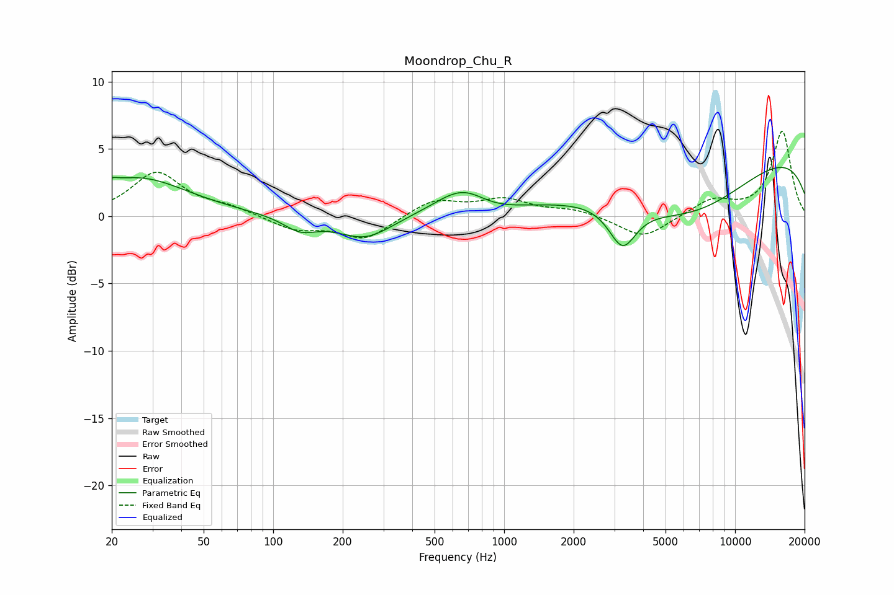

# Moondrop_Chu_R
See [usage instructions](https://github.com/jaakkopasanen/AutoEq#usage) for more options and info.

### Parametric EQs
Apply preamp of -3.7 dB when using parametric equalizer.

|   # | Type    |   Fc (Hz) |    Q |   Gain (dB) |
|-----|---------|-----------|------|-------------|
|   1 | Peaking |        20 | 5.82 |         0.3 |
|   2 | Peaking |        26 | 0.65 |         2.8 |
|   3 | Peaking |       131 | 1.96 |        -1   |
|   4 | Peaking |       250 | 1.19 |        -1.7 |
|   5 | Peaking |       656 | 1.2  |         1.9 |
|   6 | Peaking |       692 | 2.29 |         0.1 |
|   7 | Peaking |       890 | 1.45 |        -0.5 |
|   8 | Peaking |      3257 | 2.38 |        -3.1 |
|   9 | Peaking |      6266 | 0.49 |        -4.4 |
|  10 | Peaking |      9978 | 0.18 |         5.1 |

### Fixed Band EQs
When using fixed band (also called graphic) equalizer, apply preamp of **-6.4 dB** (if available) and set gains manually with these parameters.

|   # | Type    |   Fc (Hz) |    Q |   Gain (dB) |
|-----|---------|-----------|------|-------------|
|   1 | Peaking |        31 | 1.41 |         3.2 |
|   2 | Peaking |        62 | 1.41 |         0.6 |
|   3 | Peaking |       125 | 1.41 |        -1   |
|   4 | Peaking |       250 | 1.41 |        -1.7 |
|   5 | Peaking |       500 | 1.41 |         1.2 |
|   6 | Peaking |      1000 | 1.41 |         1.2 |
|   7 | Peaking |      2000 | 1.41 |         0.5 |
|   8 | Peaking |      4000 | 1.41 |        -1.7 |
|   9 | Peaking |      8000 | 1.41 |         1.2 |
|  10 | Peaking |     16000 | 1.41 |         6.3 |

### Graphs

