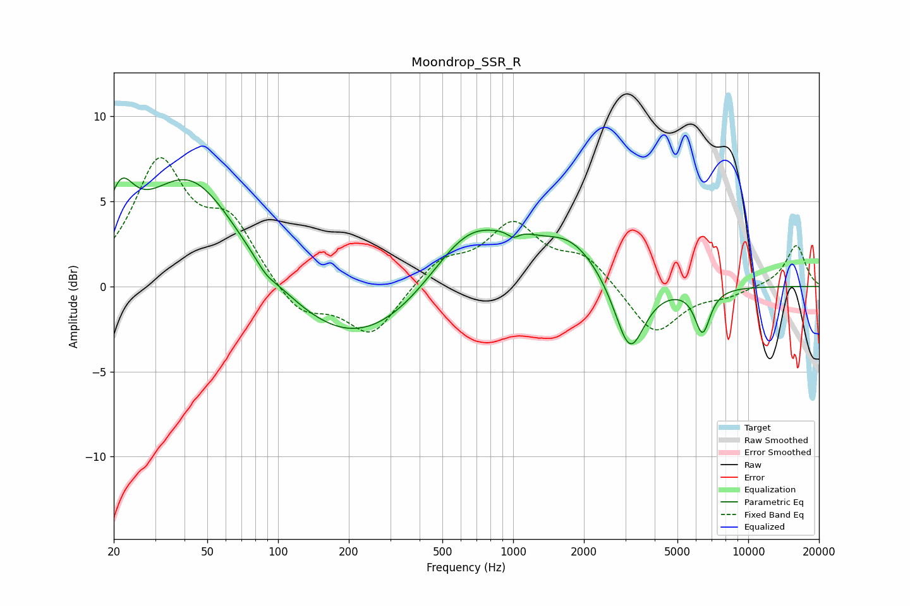

# Moondrop_SSR_R
See [usage instructions](https://github.com/jaakkopasanen/AutoEq#usage) for more options and info.

### Parametric EQs
Apply preamp of -6.5 dB when using parametric equalizer.

|   # | Type    |   Fc (Hz) |    Q |   Gain (dB) |
|-----|---------|-----------|------|-------------|
|   1 | Peaking |        21 | 2.59 |         3.1 |
|   2 | Peaking |        42 | 0.67 |         6.6 |
|   3 | Peaking |        89 | 3.5  |        -0.4 |
|   4 | Peaking |       213 | 0.47 |        -3.8 |
|   5 | Peaking |       655 | 0.82 |         4   |
|   6 | Peaking |      1002 | 5.97 |        -0.4 |
|   7 | Peaking |      1073 | 1.71 |         0.6 |
|   8 | Peaking |      1751 | 1.07 |         2.3 |
|   9 | Peaking |      3133 | 2.23 |        -4.3 |
|  10 | Peaking |      6392 | 4.14 |        -2.6 |

### Fixed Band EQs
When using fixed band (also called graphic) equalizer, apply preamp of **-7.7 dB** (if available) and set gains manually with these parameters.

|   # | Type    |   Fc (Hz) |    Q |   Gain (dB) |
|-----|---------|-----------|------|-------------|
|   1 | Peaking |        31 | 1.41 |         7   |
|   2 | Peaking |        62 | 1.41 |         3.4 |
|   3 | Peaking |       125 | 1.41 |        -1.8 |
|   4 | Peaking |       250 | 1.41 |        -2.9 |
|   5 | Peaking |       500 | 1.41 |         1.5 |
|   6 | Peaking |      1000 | 1.41 |         3.4 |
|   7 | Peaking |      2000 | 1.41 |         1.7 |
|   8 | Peaking |      4000 | 1.41 |        -2.9 |
|   9 | Peaking |      8000 | 1.41 |        -0.5 |
|  10 | Peaking |     16000 | 1.41 |         2.4 |

### Graphs

