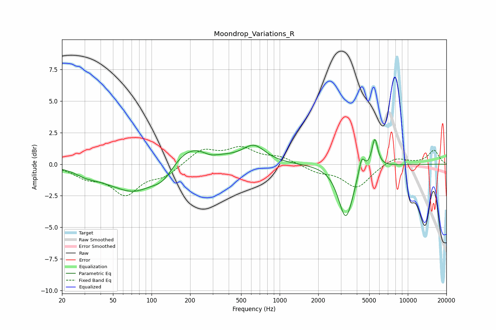

# Moondrop_Variations_R
See [usage instructions](https://github.com/jaakkopasanen/AutoEq#usage) for more options and info.

### Parametric EQs
Apply preamp of -2.1 dB when using parametric equalizer.

|   # | Type    |   Fc (Hz) |    Q |   Gain (dB) |
|-----|---------|-----------|------|-------------|
|   1 | Peaking |        31 | 1.64 |        -0.5 |
|   2 | Peaking |        44 | 1.3  |        -0.3 |
|   3 | Peaking |        73 | 0.84 |        -2.1 |
|   4 | Peaking |       123 | 1.61 |        -1.2 |
|   5 | Peaking |       198 | 0.78 |         1.8 |
|   6 | Peaking |       287 | 2.28 |        -0.4 |
|   7 | Peaking |       630 | 1.63 |         1.3 |
|   8 | Peaking |      3283 | 2.49 |        -4.2 |
|   9 | Peaking |      4364 | 6    |         1.4 |
|  10 | Peaking |      5527 | 5.97 |         2.3 |

### Fixed Band EQs
When using fixed band (also called graphic) equalizer, apply preamp of **-1.5 dB** (if available) and set gains manually with these parameters.

|   # | Type    |   Fc (Hz) |    Q |   Gain (dB) |
|-----|---------|-----------|------|-------------|
|   1 | Peaking |        31 | 1.41 |        -0.9 |
|   2 | Peaking |        62 | 1.41 |        -2.2 |
|   3 | Peaking |       125 | 1.41 |        -0.8 |
|   4 | Peaking |       250 | 1.41 |         1.2 |
|   5 | Peaking |       500 | 1.41 |         1.2 |
|   6 | Peaking |      1000 | 1.41 |         0.5 |
|   7 | Peaking |      2000 | 1.41 |        -0.5 |
|   8 | Peaking |      4000 | 1.41 |        -1.8 |
|   9 | Peaking |      8000 | 1.41 |         0.6 |
|  10 | Peaking |     16000 | 1.41 |         1.1 |

### Graphs

