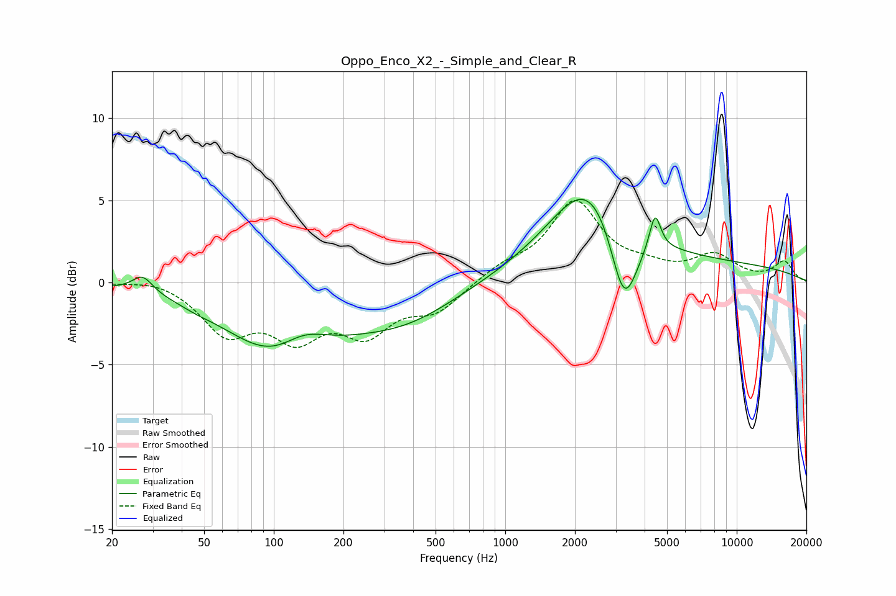

# Oppo_Enco_X2_-_Simple_and_Clear_R
See [usage instructions](https://github.com/jaakkopasanen/AutoEq#usage) for more options and info.

### Parametric EQs
Apply preamp of -5.2 dB when using parametric equalizer.

|   # | Type    |   Fc (Hz) |    Q |   Gain (dB) |
|-----|---------|-----------|------|-------------|
|   1 | Peaking |        27 | 3.2  |         1.1 |
|   2 | Peaking |        46 | 2.21 |        -0.2 |
|   3 | Peaking |       112 | 0.61 |        -4.9 |
|   4 | Peaking |       134 | 1.24 |         2   |
|   5 | Peaking |       371 | 0.62 |        -1.9 |
|   6 | Peaking |      2179 | 0.95 |         0.7 |
|   7 | Peaking |      2428 | 0.81 |         5   |
|   8 | Peaking |      3256 | 2.26 |        -5.8 |
|   9 | Peaking |      4438 | 5.83 |         2.2 |
|  10 | Peaking |      5777 | 0.18 |         1.1 |

### Fixed Band EQs
When using fixed band (also called graphic) equalizer, apply preamp of **-5.1 dB** (if available) and set gains manually with these parameters.

|   # | Type    |   Fc (Hz) |    Q |   Gain (dB) |
|-----|---------|-----------|------|-------------|
|   1 | Peaking |        31 | 1.41 |         0.3 |
|   2 | Peaking |        62 | 1.41 |        -2.9 |
|   3 | Peaking |       125 | 1.41 |        -2.9 |
|   4 | Peaking |       250 | 1.41 |        -2.7 |
|   5 | Peaking |       500 | 1.41 |        -1.6 |
|   6 | Peaking |      1000 | 1.41 |         0.8 |
|   7 | Peaking |      2000 | 1.41 |         4.8 |
|   8 | Peaking |      4000 | 1.41 |         0.6 |
|   9 | Peaking |      8000 | 1.41 |         1.5 |
|  10 | Peaking |     16000 | 1.41 |         1.2 |

### Graphs

