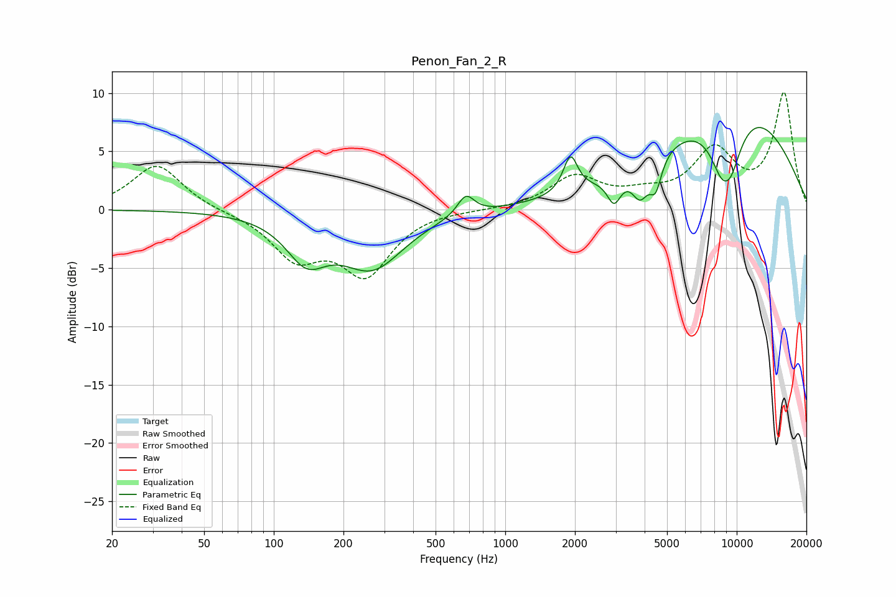

# Penon_Fan_2_R
See [usage instructions](https://github.com/jaakkopasanen/AutoEq#usage) for more options and info.

### Parametric EQs
Apply preamp of -7.1 dB when using parametric equalizer.

|   # | Type    |   Fc (Hz) |    Q |   Gain (dB) |
|-----|---------|-----------|------|-------------|
|   1 | Peaking |       138 | 1.62 |        -3.5 |
|   2 | Peaking |       267 | 1.03 |        -4.7 |
|   3 | Peaking |       676 | 3.86 |         1.8 |
|   4 | Peaking |      1914 | 4.64 |         3.1 |
|   5 | Peaking |      2952 | 4.75 |        -2.2 |
|   6 | Peaking |      3828 | 3.93 |        -2.8 |
|   7 | Peaking |      4463 | 5.43 |        -2.6 |
|   8 | Peaking |      8989 | 4.2  |         2.1 |
|   9 | Peaking |      8998 | 2.26 |        -9.1 |
|  10 | Peaking |      9582 | 0.39 |         9.6 |

### Fixed Band EQs
When using fixed band (also called graphic) equalizer, apply preamp of **-10.1 dB** (if available) and set gains manually with these parameters.

|   # | Type    |   Fc (Hz) |    Q |   Gain (dB) |
|-----|---------|-----------|------|-------------|
|   1 | Peaking |        31 | 1.41 |         3.9 |
|   2 | Peaking |        62 | 1.41 |        -0.1 |
|   3 | Peaking |       125 | 1.41 |        -3.8 |
|   4 | Peaking |       250 | 1.41 |        -5.3 |
|   5 | Peaking |       500 | 1.41 |         0.1 |
|   6 | Peaking |      1000 | 1.41 |         0   |
|   7 | Peaking |      2000 | 1.41 |         2.7 |
|   8 | Peaking |      4000 | 1.41 |         1   |
|   9 | Peaking |      8000 | 1.41 |         4.8 |
|  10 | Peaking |     16000 | 1.41 |         9.9 |

### Graphs

