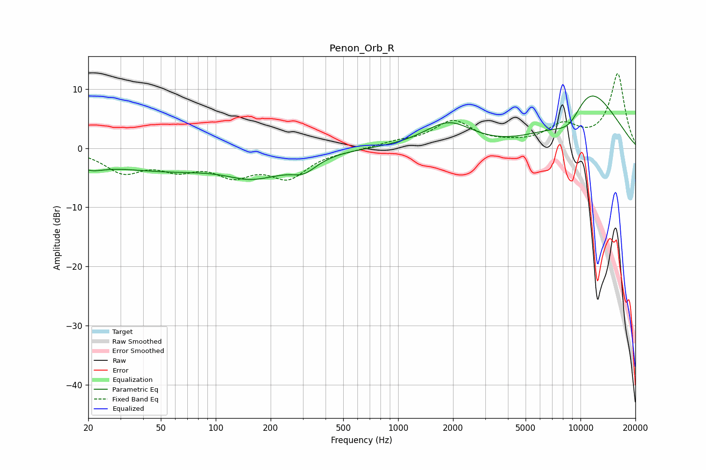

# Penon_Orb_R
See [usage instructions](https://github.com/jaakkopasanen/AutoEq#usage) for more options and info.

### Parametric EQs
Apply preamp of -8.9 dB when using parametric equalizer.

|   # | Type    |   Fc (Hz) |    Q |   Gain (dB) |
|-----|---------|-----------|------|-------------|
|   1 | Peaking |        20 | 1.89 |        -1.5 |
|   2 | Peaking |        53 | 0.36 |        -3.6 |
|   3 | Peaking |       146 | 1.34 |        -1.1 |
|   4 | Peaking |       176 | 1.33 |         0.7 |
|   5 | Peaking |       184 | 0.98 |        -3   |
|   6 | Peaking |       304 | 1.93 |        -2.3 |
|   7 | Peaking |      1898 | 1.02 |         4.7 |
|   8 | Peaking |      8836 | 0.6  |       -20   |
|   9 | Peaking |     10000 | 0.51 |        14   |
|  10 | Peaking |     10000 | 0.56 |        11.4 |

### Fixed Band EQs
When using fixed band (also called graphic) equalizer, apply preamp of **-12.7 dB** (if available) and set gains manually with these parameters.

|   # | Type    |   Fc (Hz) |    Q |   Gain (dB) |
|-----|---------|-----------|------|-------------|
|   1 | Peaking |        31 | 1.41 |        -3.7 |
|   2 | Peaking |        62 | 1.41 |        -2.9 |
|   3 | Peaking |       125 | 1.41 |        -3.9 |
|   4 | Peaking |       250 | 1.41 |        -4.5 |
|   5 | Peaking |       500 | 1.41 |        -0.3 |
|   6 | Peaking |      1000 | 1.41 |         0.8 |
|   7 | Peaking |      2000 | 1.41 |         4.4 |
|   8 | Peaking |      4000 | 1.41 |         0.4 |
|   9 | Peaking |      8000 | 1.41 |         3.5 |
|  10 | Peaking |     16000 | 1.41 |        12.5 |

### Graphs

