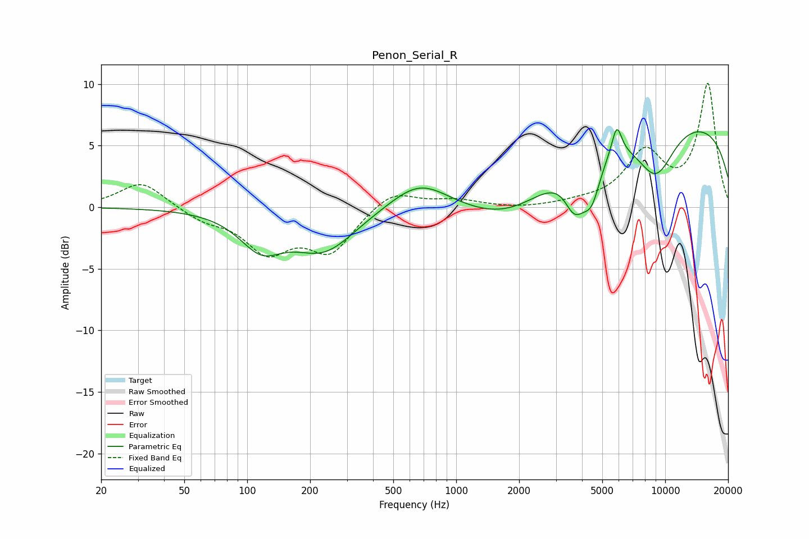

# Penon_Serial_R
See [usage instructions](https://github.com/jaakkopasanen/AutoEq#usage) for more options and info.

### Parametric EQs
Apply preamp of -6.4 dB when using parametric equalizer.

|   # | Type    |   Fc (Hz) |    Q |   Gain (dB) |
|-----|---------|-----------|------|-------------|
|   1 | Peaking |       116 | 1.37 |        -2.8 |
|   2 | Peaking |       233 | 0.93 |        -3.4 |
|   3 | Peaking |       669 | 1.01 |         2.4 |
|   4 | Peaking |      1884 | 0.63 |        -3.3 |
|   5 | Peaking |      3667 | 2.98 |        -3   |
|   6 | Peaking |      4011 | 4.74 |        -0.3 |
|   7 | Peaking |      4450 | 3.27 |        -3.2 |
|   8 | Peaking |      5866 | 5.79 |         2.4 |
|   9 | Peaking |      9021 | 1.36 |        -4.3 |
|  10 | Peaking |      9676 | 0.18 |         7.4 |

### Fixed Band EQs
When using fixed band (also called graphic) equalizer, apply preamp of **-10.1 dB** (if available) and set gains manually with these parameters.

|   # | Type    |   Fc (Hz) |    Q |   Gain (dB) |
|-----|---------|-----------|------|-------------|
|   1 | Peaking |        31 | 1.41 |         2.1 |
|   2 | Peaking |        62 | 1.41 |        -0.9 |
|   3 | Peaking |       125 | 1.41 |        -3.4 |
|   4 | Peaking |       250 | 1.41 |        -3.4 |
|   5 | Peaking |       500 | 1.41 |         1.5 |
|   6 | Peaking |      1000 | 1.41 |         0.6 |
|   7 | Peaking |      2000 | 1.41 |        -0.1 |
|   8 | Peaking |      4000 | 1.41 |         0.3 |
|   9 | Peaking |      8000 | 1.41 |         4.2 |
|  10 | Peaking |     16000 | 1.41 |         9.9 |

### Graphs

