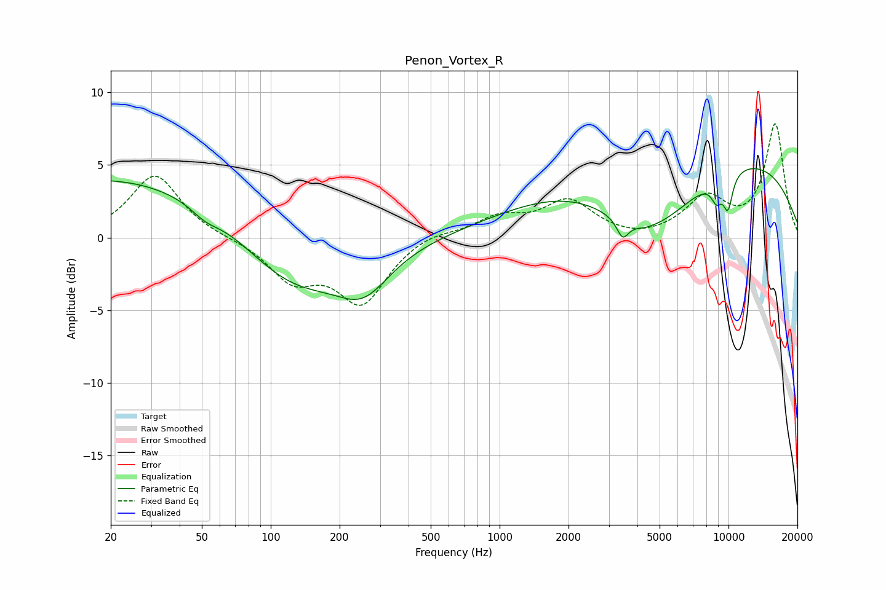

# Penon_Vortex_R
See [usage instructions](https://github.com/jaakkopasanen/AutoEq#usage) for more options and info.

### Parametric EQs
Apply preamp of -4.8 dB when using parametric equalizer.

|   # | Type    |   Fc (Hz) |    Q |   Gain (dB) |
|-----|---------|-----------|------|-------------|
|   1 | Peaking |        29 | 0.18 |         4.5 |
|   2 | Peaking |        52 | 2.37 |        -0.6 |
|   3 | Peaking |       122 | 0.57 |        -5.5 |
|   4 | Peaking |       254 | 1.22 |        -2.7 |
|   5 | Peaking |      3448 | 5.61 |        -1.2 |
|   6 | Peaking |      4289 | 4.26 |        -0.1 |
|   7 | Peaking |      4516 | 0.65 |        -5.4 |
|   8 | Peaking |      6755 | 0.18 |         6.6 |
|   9 | Peaking |      8886 | 5.22 |        -1.4 |
|  10 | Peaking |      9948 | 5.88 |        -2.3 |

### Fixed Band EQs
When using fixed band (also called graphic) equalizer, apply preamp of **-7.9 dB** (if available) and set gains manually with these parameters.

|   # | Type    |   Fc (Hz) |    Q |   Gain (dB) |
|-----|---------|-----------|------|-------------|
|   1 | Peaking |        31 | 1.41 |         4.4 |
|   2 | Peaking |        62 | 1.41 |        -0   |
|   3 | Peaking |       125 | 1.41 |        -2.7 |
|   4 | Peaking |       250 | 1.41 |        -4.3 |
|   5 | Peaking |       500 | 1.41 |         0.5 |
|   6 | Peaking |      1000 | 1.41 |         1.3 |
|   7 | Peaking |      2000 | 1.41 |         2.4 |
|   8 | Peaking |      4000 | 1.41 |        -0.3 |
|   9 | Peaking |      8000 | 1.41 |         2.6 |
|  10 | Peaking |     16000 | 1.41 |         7.8 |

### Graphs

