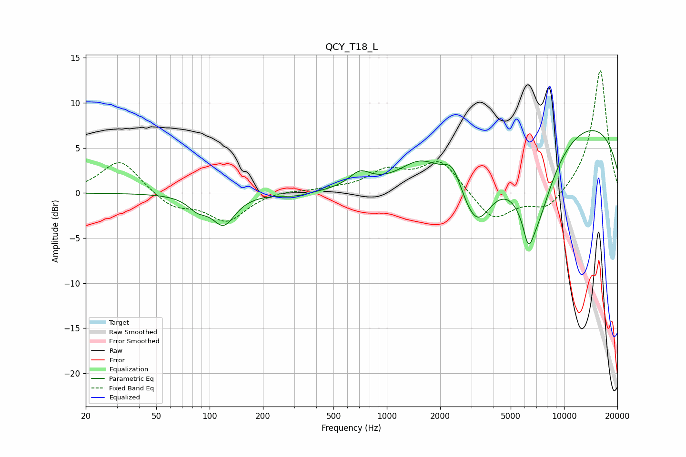

# QCY_T18_L
See [usage instructions](https://github.com/jaakkopasanen/AutoEq#usage) for more options and info.

### Parametric EQs
Apply preamp of -7.0 dB when using parametric equalizer.

|   # | Type    |   Fc (Hz) |    Q |   Gain (dB) |
|-----|---------|-----------|------|-------------|
|   1 | Peaking |        86 | 2.58 |        -1.3 |
|   2 | Peaking |       120 | 2.21 |        -3.3 |
|   3 | Peaking |       309 | 1.87 |        -0.4 |
|   4 | Peaking |       704 | 2.33 |         1.6 |
|   5 | Peaking |      1531 | 1.33 |         2.1 |
|   6 | Peaking |      2348 | 2.92 |         2.3 |
|   7 | Peaking |      3202 | 1.46 |        -7.2 |
|   8 | Peaking |      6283 | 5.05 |        -2.9 |
|   9 | Peaking |      6812 | 1.21 |       -10.4 |
|  10 | Peaking |     10000 | 0.2  |         8.7 |

### Fixed Band EQs
When using fixed band (also called graphic) equalizer, apply preamp of **-13.7 dB** (if available) and set gains manually with these parameters.

|   # | Type    |   Fc (Hz) |    Q |   Gain (dB) |
|-----|---------|-----------|------|-------------|
|   1 | Peaking |        31 | 1.41 |         3.7 |
|   2 | Peaking |        62 | 1.41 |        -1.6 |
|   3 | Peaking |       125 | 1.41 |        -3.1 |
|   4 | Peaking |       250 | 1.41 |         0.3 |
|   5 | Peaking |       500 | 1.41 |         0.3 |
|   6 | Peaking |      1000 | 1.41 |         2.2 |
|   7 | Peaking |      2000 | 1.41 |         3.6 |
|   8 | Peaking |      4000 | 1.41 |        -3.2 |
|   9 | Peaking |      8000 | 1.41 |        -2   |
|  10 | Peaking |     16000 | 1.41 |        13.8 |

### Graphs

