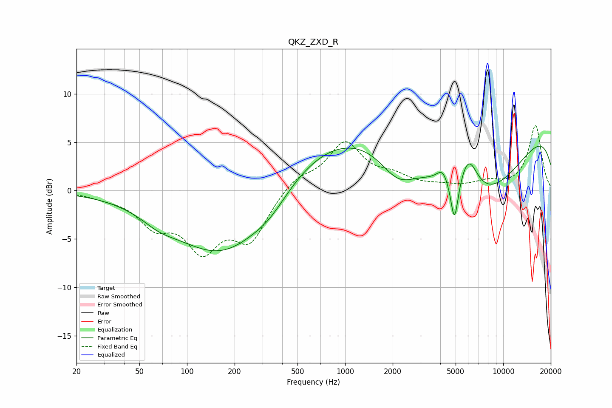

# QKZ_ZXD_R
See [usage instructions](https://github.com/jaakkopasanen/AutoEq#usage) for more options and info.

### Parametric EQs
Apply preamp of -4.7 dB when using parametric equalizer.

|   # | Type    |   Fc (Hz) |    Q |   Gain (dB) |
|-----|---------|-----------|------|-------------|
|   1 | Peaking |        66 | 1.37 |        -0.9 |
|   2 | Peaking |       180 | 0.44 |        -7.7 |
|   3 | Peaking |       337 | 1.22 |        -1.3 |
|   4 | Peaking |       815 | 0.32 |         5.9 |
|   5 | Peaking |      2155 | 1.24 |        -2.9 |
|   6 | Peaking |      4139 | 3.69 |         1.4 |
|   7 | Peaking |      4919 | 5.91 |        -4.6 |
|   8 | Peaking |      6036 | 2.33 |         3.8 |
|   9 | Peaking |      6851 | 0.39 |        -9.5 |
|  10 | Peaking |     10000 | 0.18 |         8.7 |

### Fixed Band EQs
When using fixed band (also called graphic) equalizer, apply preamp of **-6.8 dB** (if available) and set gains manually with these parameters.

|   # | Type    |   Fc (Hz) |    Q |   Gain (dB) |
|-----|---------|-----------|------|-------------|
|   1 | Peaking |        31 | 1.41 |        -0.5 |
|   2 | Peaking |        62 | 1.41 |        -3.1 |
|   3 | Peaking |       125 | 1.41 |        -5.4 |
|   4 | Peaking |       250 | 1.41 |        -4.8 |
|   5 | Peaking |       500 | 1.41 |         1.4 |
|   6 | Peaking |      1000 | 1.41 |         4.8 |
|   7 | Peaking |      2000 | 1.41 |         1.2 |
|   8 | Peaking |      4000 | 1.41 |         0.3 |
|   9 | Peaking |      8000 | 1.41 |         0.8 |
|  10 | Peaking |     16000 | 1.41 |         6.7 |

### Graphs

