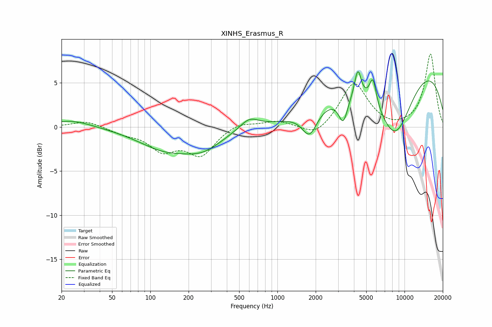

# XINHS_Erasmus_R
See [usage instructions](https://github.com/jaakkopasanen/AutoEq#usage) for more options and info.

### Parametric EQs
Apply preamp of -6.4 dB when using parametric equalizer.

|   # | Type    |   Fc (Hz) |    Q |   Gain (dB) |
|-----|---------|-----------|------|-------------|
|   1 | Peaking |        24 | 0.93 |         0.8 |
|   2 | Peaking |       130 | 0.66 |        -2.3 |
|   3 | Peaking |       262 | 0.93 |        -1.9 |
|   4 | Peaking |       601 | 1.94 |         1.2 |
|   5 | Peaking |      1791 | 2.39 |        -2.8 |
|   6 | Peaking |      3293 | 4    |        -2.9 |
|   7 | Peaking |      4292 | 5.5  |         3.2 |
|   8 | Peaking |      5640 | 5.08 |         3   |
|   9 | Peaking |      8406 | 0.84 |        -8.8 |
|  10 | Peaking |      9887 | 0.23 |         8.4 |

### Fixed Band EQs
When using fixed band (also called graphic) equalizer, apply preamp of **-8.3 dB** (if available) and set gains manually with these parameters.

|   # | Type    |   Fc (Hz) |    Q |   Gain (dB) |
|-----|---------|-----------|------|-------------|
|   1 | Peaking |        31 | 1.41 |         0.7 |
|   2 | Peaking |        62 | 1.41 |        -0.6 |
|   3 | Peaking |       125 | 1.41 |        -2.4 |
|   4 | Peaking |       250 | 1.41 |        -3   |
|   5 | Peaking |       500 | 1.41 |         0.6 |
|   6 | Peaking |      1000 | 1.41 |         0.7 |
|   7 | Peaking |      2000 | 1.41 |        -1.3 |
|   8 | Peaking |      4000 | 1.41 |         5   |
|   9 | Peaking |      8000 | 1.41 |        -0.3 |
|  10 | Peaking |     16000 | 1.41 |         8.3 |

### Graphs

