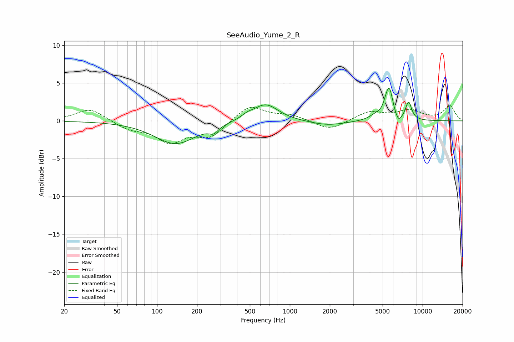

# SeeAudio_Yume_2_R
See [usage instructions](https://github.com/jaakkopasanen/AutoEq#usage) for more options and info.

### Parametric EQs
Apply preamp of -4.4 dB when using parametric equalizer.

|   # | Type    |   Fc (Hz) |    Q |   Gain (dB) |
|-----|---------|-----------|------|-------------|
|   1 | Peaking |       138 | 0.9  |        -3   |
|   2 | Peaking |       267 | 4.18 |        -0.8 |
|   3 | Peaking |       476 | 3.28 |         0.4 |
|   4 | Peaking |       656 | 1.49 |         2.3 |
|   5 | Peaking |      1922 | 1.06 |        -0.6 |
|   6 | Peaking |      4474 | 2.75 |         0.7 |
|   7 | Peaking |      5335 | 5.96 |         1.2 |
|   8 | Peaking |      5646 | 5.42 |         3.3 |
|   9 | Peaking |      6584 | 6    |        -0.9 |
|  10 | Peaking |      7839 | 5.71 |         2.4 |

### Fixed Band EQs
When using fixed band (also called graphic) equalizer, apply preamp of **-2.1 dB** (if available) and set gains manually with these parameters.

|   # | Type    |   Fc (Hz) |    Q |   Gain (dB) |
|-----|---------|-----------|------|-------------|
|   1 | Peaking |        31 | 1.41 |         1.7 |
|   2 | Peaking |        62 | 1.41 |        -1   |
|   3 | Peaking |       125 | 1.41 |        -2.6 |
|   4 | Peaking |       250 | 1.41 |        -2   |
|   5 | Peaking |       500 | 1.41 |         2.1 |
|   6 | Peaking |      1000 | 1.41 |         0.7 |
|   7 | Peaking |      2000 | 1.41 |        -1.3 |
|   8 | Peaking |      4000 | 1.41 |         1.2 |
|   9 | Peaking |      8000 | 1.41 |         1.3 |
|  10 | Peaking |     16000 | 1.41 |         2   |

### Graphs

