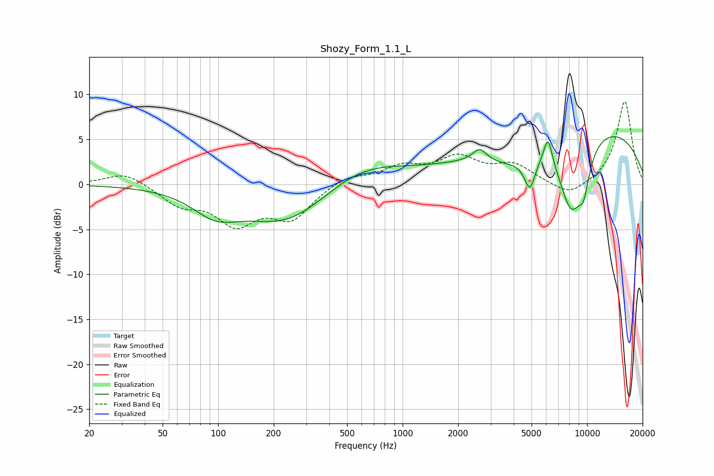

# Shozy_Form_1.1_L
See [usage instructions](https://github.com/jaakkopasanen/AutoEq#usage) for more options and info.

### Parametric EQs
Apply preamp of -5.4 dB when using parametric equalizer.

|   # | Type    |   Fc (Hz) |    Q |   Gain (dB) |
|-----|---------|-----------|------|-------------|
|   1 | Peaking |        96 | 1.16 |        -2.4 |
|   2 | Peaking |       242 | 0.58 |        -4.7 |
|   3 | Peaking |       578 | 0.58 |         2.9 |
|   4 | Peaking |      2616 | 3.83 |         1.4 |
|   5 | Peaking |      3888 | 0.94 |        -2.3 |
|   6 | Peaking |      4894 | 4.59 |        -3.5 |
|   7 | Peaking |      6143 | 5.88 |         3.1 |
|   8 | Peaking |      8189 | 1.85 |        -8.3 |
|   9 | Peaking |      9171 | 0.23 |         7   |
|  10 | Peaking |      9597 | 3.88 |        -3.4 |

### Fixed Band EQs
When using fixed band (also called graphic) equalizer, apply preamp of **-9.3 dB** (if available) and set gains manually with these parameters.

|   # | Type    |   Fc (Hz) |    Q |   Gain (dB) |
|-----|---------|-----------|------|-------------|
|   1 | Peaking |        31 | 1.41 |         1.4 |
|   2 | Peaking |        62 | 1.41 |        -2.1 |
|   3 | Peaking |       125 | 1.41 |        -4   |
|   4 | Peaking |       250 | 1.41 |        -3.5 |
|   5 | Peaking |       500 | 1.41 |         1   |
|   6 | Peaking |      1000 | 1.41 |         1.8 |
|   7 | Peaking |      2000 | 1.41 |         2.7 |
|   8 | Peaking |      4000 | 1.41 |         2   |
|   9 | Peaking |      8000 | 1.41 |        -1.5 |
|  10 | Peaking |     16000 | 1.41 |         9.3 |

### Graphs

