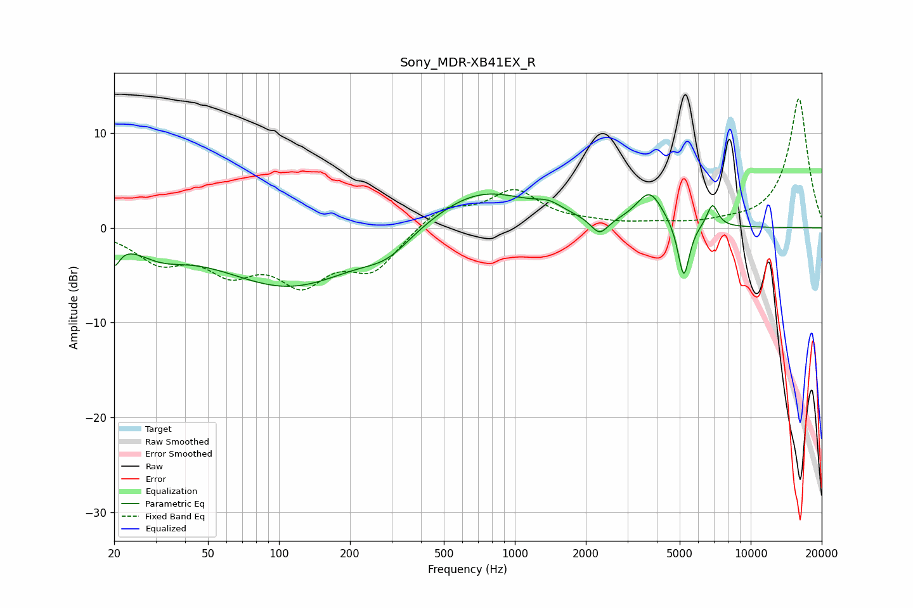

# Sony_MDR-XB41EX_R
See [usage instructions](https://github.com/jaakkopasanen/AutoEq#usage) for more options and info.

### Parametric EQs
Apply preamp of -3.6 dB when using parametric equalizer.

|   # | Type    |   Fc (Hz) |    Q |   Gain (dB) |
|-----|---------|-----------|------|-------------|
|   1 | Peaking |        20 | 5.9  |        -2.4 |
|   2 | Peaking |        31 | 1.3  |        -1.8 |
|   3 | Peaking |       111 | 0.48 |        -6.2 |
|   4 | Peaking |       288 | 1.42 |        -1.8 |
|   5 | Peaking |       712 | 0.64 |         4.2 |
|   6 | Peaking |      1397 | 2.56 |         0.8 |
|   7 | Peaking |      2286 | 3.8  |        -1.8 |
|   8 | Peaking |      3729 | 2.5  |         3.5 |
|   9 | Peaking |      5200 | 5.7  |        -6   |
|  10 | Peaking |      6885 | 5.72 |         2.4 |

### Fixed Band EQs
When using fixed band (also called graphic) equalizer, apply preamp of **-13.7 dB** (if available) and set gains manually with these parameters.

|   # | Type    |   Fc (Hz) |    Q |   Gain (dB) |
|-----|---------|-----------|------|-------------|
|   1 | Peaking |        31 | 1.41 |        -3.2 |
|   2 | Peaking |        62 | 1.41 |        -3.9 |
|   3 | Peaking |       125 | 1.41 |        -5.1 |
|   4 | Peaking |       250 | 1.41 |        -4.1 |
|   5 | Peaking |       500 | 1.41 |         2.2 |
|   6 | Peaking |      1000 | 1.41 |         3.7 |
|   7 | Peaking |      2000 | 1.41 |         0.4 |
|   8 | Peaking |      4000 | 1.41 |         0.3 |
|   9 | Peaking |      8000 | 1.41 |         0.3 |
|  10 | Peaking |     16000 | 1.41 |        13.7 |

### Graphs

