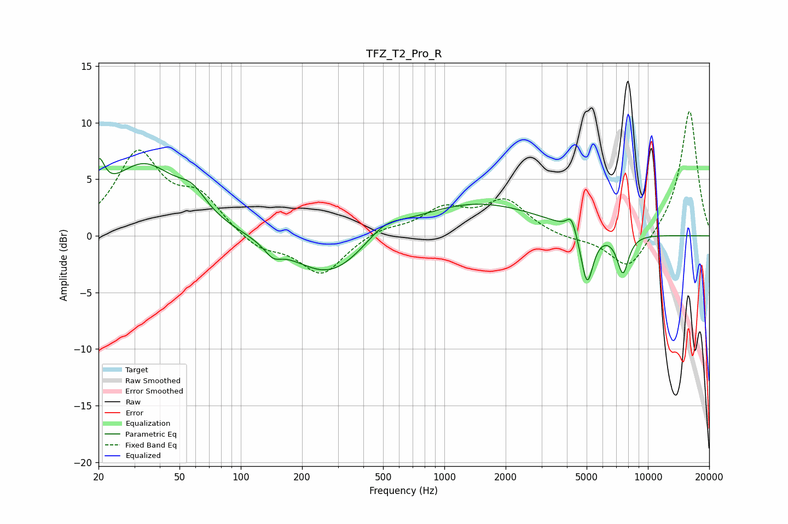

# TFZ_T2_Pro_R
See [usage instructions](https://github.com/jaakkopasanen/AutoEq#usage) for more options and info.

### Parametric EQs
Apply preamp of -6.9 dB when using parametric equalizer.

|   # | Type    |   Fc (Hz) |    Q |   Gain (dB) |
|-----|---------|-----------|------|-------------|
|   1 | Peaking |        20 | 4.88 |         3.4 |
|   2 | Peaking |        33 | 0.83 |         6.1 |
|   3 | Peaking |        58 | 2.06 |         1.7 |
|   4 | Peaking |       144 | 3.4  |        -1   |
|   5 | Peaking |       273 | 0.79 |        -3.8 |
|   6 | Peaking |       506 | 1.59 |         1.3 |
|   7 | Peaking |      1413 | 0.45 |         3   |
|   8 | Peaking |      4210 | 5.93 |         1.4 |
|   9 | Peaking |      5026 | 4.62 |        -4.8 |
|  10 | Peaking |      7536 | 4.59 |        -3.5 |

### Fixed Band EQs
When using fixed band (also called graphic) equalizer, apply preamp of **-11.1 dB** (if available) and set gains manually with these parameters.

|   # | Type    |   Fc (Hz) |    Q |   Gain (dB) |
|-----|---------|-----------|------|-------------|
|   1 | Peaking |        31 | 1.41 |         7.1 |
|   2 | Peaking |        62 | 1.41 |         3.1 |
|   3 | Peaking |       125 | 1.41 |        -1.3 |
|   4 | Peaking |       250 | 1.41 |        -3.4 |
|   5 | Peaking |       500 | 1.41 |         0.7 |
|   6 | Peaking |      1000 | 1.41 |         2.2 |
|   7 | Peaking |      2000 | 1.41 |         3   |
|   8 | Peaking |      4000 | 1.41 |        -0.3 |
|   9 | Peaking |      8000 | 1.41 |        -3.2 |
|  10 | Peaking |     16000 | 1.41 |        11.2 |

### Graphs

