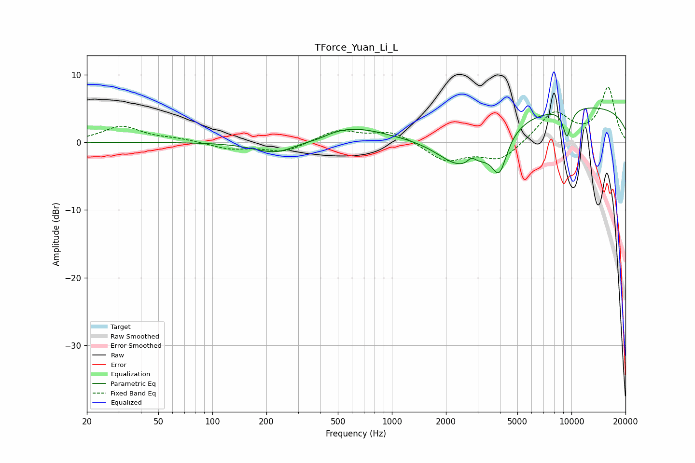

# TForce_Yuan_Li_L
See [usage instructions](https://github.com/jaakkopasanen/AutoEq#usage) for more options and info.

### Parametric EQs
Apply preamp of -5.2 dB when using parametric equalizer.

|   # | Type    |   Fc (Hz) |    Q |   Gain (dB) |
|-----|---------|-----------|------|-------------|
|   1 | Peaking |       228 | 1.14 |        -2   |
|   2 | Peaking |       388 | 2.2  |        -0.4 |
|   3 | Peaking |       573 | 0.73 |         2.3 |
|   4 | Peaking |      2388 | 2.7  |         0.3 |
|   5 | Peaking |      2462 | 1.02 |        -5.2 |
|   6 | Peaking |      2775 | 5.31 |         1.3 |
|   7 | Peaking |      2920 | 1.12 |        -1.9 |
|   8 | Peaking |      3972 | 3.37 |        -5.3 |
|   9 | Peaking |      9448 | 5.44 |        -4.1 |
|  10 | Peaking |      9975 | 0.18 |         5.5 |

### Fixed Band EQs
When using fixed band (also called graphic) equalizer, apply preamp of **-8.2 dB** (if available) and set gains manually with these parameters.

|   # | Type    |   Fc (Hz) |    Q |   Gain (dB) |
|-----|---------|-----------|------|-------------|
|   1 | Peaking |        31 | 1.41 |         2.3 |
|   2 | Peaking |        62 | 1.41 |         0.4 |
|   3 | Peaking |       125 | 1.41 |        -1   |
|   4 | Peaking |       250 | 1.41 |        -1.5 |
|   5 | Peaking |       500 | 1.41 |         1.8 |
|   6 | Peaking |      1000 | 1.41 |         1.6 |
|   7 | Peaking |      2000 | 1.41 |        -2.7 |
|   8 | Peaking |      4000 | 1.41 |        -2.7 |
|   9 | Peaking |      8000 | 1.41 |         4.5 |
|  10 | Peaking |     16000 | 1.41 |         8   |

### Graphs

