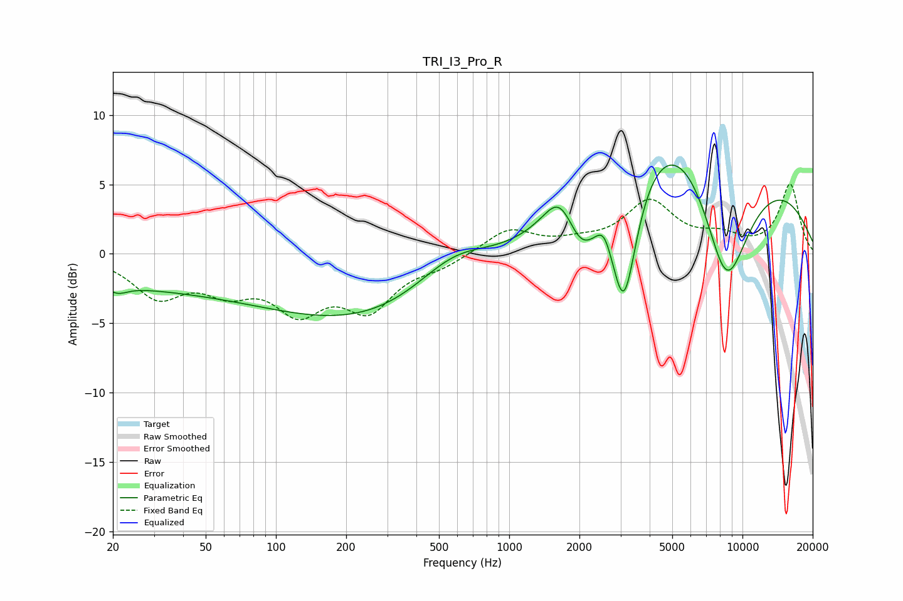

# TRI_I3_Pro_R
See [usage instructions](https://github.com/jaakkopasanen/AutoEq#usage) for more options and info.

### Parametric EQs
Apply preamp of -6.5 dB when using parametric equalizer.

|   # | Type    |   Fc (Hz) |    Q |   Gain (dB) |
|-----|---------|-----------|------|-------------|
|   1 | Peaking |        21 | 3.37 |        -0.6 |
|   2 | Peaking |        27 | 0.31 |        -2   |
|   3 | Peaking |       433 | 0.2  |        -5.7 |
|   4 | Peaking |       583 | 0.78 |         3.5 |
|   5 | Peaking |      1650 | 2.18 |         2.5 |
|   6 | Peaking |      2040 | 1.93 |        -3.7 |
|   7 | Peaking |      2548 | 4.61 |         1.1 |
|   8 | Peaking |      3102 | 2.31 |       -10.5 |
|   9 | Peaking |      5902 | 0.28 |        15.4 |
|  10 | Peaking |      8488 | 0.92 |       -14.6 |

### Fixed Band EQs
When using fixed band (also called graphic) equalizer, apply preamp of **-5.1 dB** (if available) and set gains manually with these parameters.

|   # | Type    |   Fc (Hz) |    Q |   Gain (dB) |
|-----|---------|-----------|------|-------------|
|   1 | Peaking |        31 | 1.41 |        -2.9 |
|   2 | Peaking |        62 | 1.41 |        -2.1 |
|   3 | Peaking |       125 | 1.41 |        -3.6 |
|   4 | Peaking |       250 | 1.41 |        -3.6 |
|   5 | Peaking |       500 | 1.41 |        -0.8 |
|   6 | Peaking |      1000 | 1.41 |         1.8 |
|   7 | Peaking |      2000 | 1.41 |         0.6 |
|   8 | Peaking |      4000 | 1.41 |         3.6 |
|   9 | Peaking |      8000 | 1.41 |         1   |
|  10 | Peaking |     16000 | 1.41 |         5   |

### Graphs

